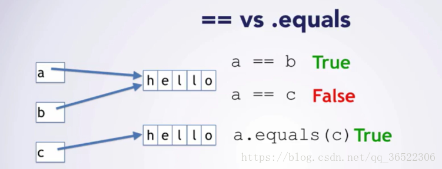

## 总结两者的区别

### ==是判断两个变量或实例是不是指向同一个内存空间，equals是判断两个变量或实例所指向的内存空间的值是不是相同

### ==是指对内存地址进行比较 ， equals()是对字符串的内容进行比较

### ==指引用是否相同， equals()指的是值是否相同

## 区别演示

### 

## 区别详解

### == 比较的是变量(栈)内存中存放的对象的(堆)内存地址，用来判断两个对象的地址是否相同，即是否是指相同一个对象。比较的是真正意义上的指针操作。equals用来比较的是两个对象的内容是否相等，由于所有的类都是继承自java.lang.Object类的，所以适用于所有对象，如果没有对该方法进行覆盖的话，调用的仍然是Object类中的方法，而Object中的equals方法返回的却是==的判断

## 参考文献
### [文献1](https://blog.csdn.net/qq_36522306/article/details/80550210)