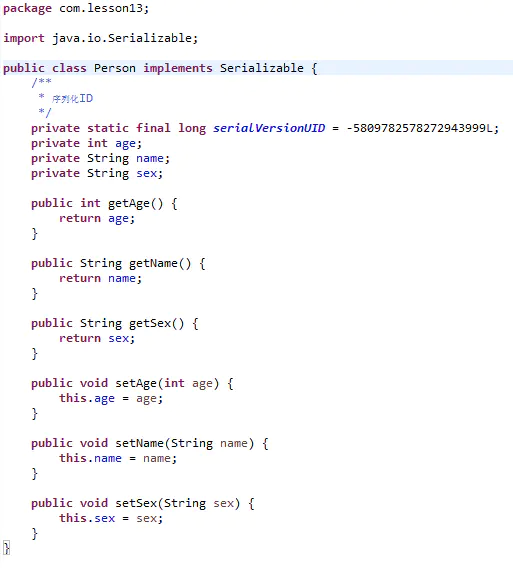
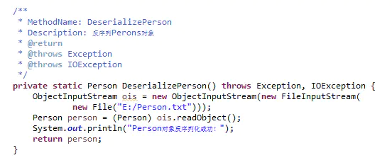
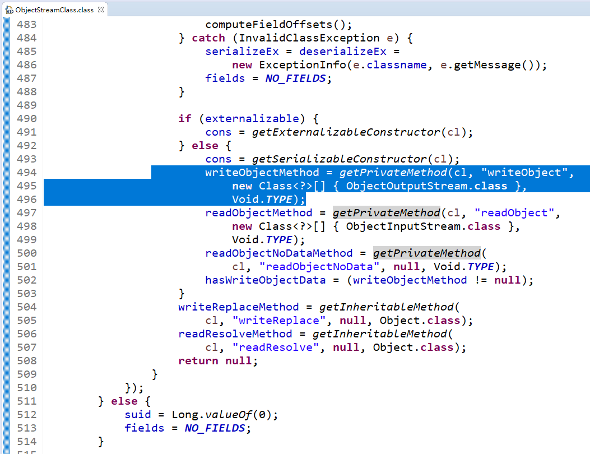

## 序列化和反序列化概述

### 概念
#### 序列化：把对象转换为字节序列的过程
#### 反序列化：把字节序列还原成对象的过程

### 主要用途
#### 把对象转换成字节序列，让他们离开内存空间，永久保存到硬盘上，通常存放在一个文件中
```
Web服务器中的Session对象，当有 10万用户并发访问，就有可能出现10万个Session对象，内存可能吃不消，
于是Web容器就会把一些session先序列化到硬盘中，等要用了，再把保存在硬盘中的对象还原到内存中
```
#### 在网络上传送对象的字节序列
```
当两个进程在进行远程通信时，彼此可以发送各种类型的数据。无论是何种类型的数据，都会以二进制序列的形式在网络上传送。
发送方需要把这个Java对象转换为字节序列，才能在网络上传送；接收方则需要把字节序列再恢复为Java对象
```

## JDK类库中的序列化API：java.io包

### 对象输出流：ObjectOutputStream
#### 核心方法
```
ObjectOutputStream(OutputStream out)
通过输出流构造ObjectOutputStream对象

void writeObject(Object obj)
对参数指定的obj对象进行序列化，把得到的字节序列写到一个目标输出流中
```
#### 使用示例



### 对象输入流：ObjectInputStream
#### 核心方法
```
ObjectInputStream(InputStream in)
通过输入流构造ObjectInputStream对象

Object readObject()
从一个源输入流中读取字节序列，再把它们反序列化为一个对象，并将其返回
```
#### 使用示例


### Seriliazable接口

#### 实现Serializable接口的类提供两种方式进行序列化
1. 采用默认序列化方式，将非transatient和非static的属性进行序列化
2. 编写readObject和writeObject完成部分属性的序列化

#### serialVersionUID：序列化的版本号，凡是实现Serializable接口的类都有这么一个表示序列化版本标识符的静态变量；当实体中增加属性后，文件流中的class和classpath中的class，也就是修改过后的class，不兼容了，处于安全机制考虑，程序抛出了错误，并且拒绝载入。那么如果我们真的有需求要在序列化后添加一个字段或者方法呢？应该怎么办？那就是自己去指定serialVersionUID。在例子中，如果没有指定Person类的serialVersionUID的，那么java编译器会自动给这个class进行一个摘要算法，类似于指纹算法，只要这个文件多一个空格，得到的UID就会截然不同的，可以保证在这么多类中，这个编号是唯一的。所以，添加了一个字段后，由于没有显指定serialVersionUID，编译器又为我们生成了一个UID，当然和前面保存在文件中的那个不会一样了，于是就出现了2个序列化版本号不一致的错误。因此，只要我们自己指定了serialVersionUID，就可以在序列化后，去添加一个字段，或者方法，而不会影响到后期的还原，还原后的对象照样可以使用，而且还多了方法或者属性可以用。可以说serialVersionUID是序列化和反序列化之间彼此认识的唯一信物
```
private final static long serialVersionUID = 12345678L;
```
#### serialVersionUID的取值是Java运行时环境根据类的内部细节自动生成的。如果对类的源代码作了修改，再重新编译，新生成的类文件的serialVersionUID的取值有可能也会发生变化
#### 通常建议在序列化类中显示设置一个serialVersionUID值

### Externalizable接口
#### Externalizable接口继承自 Serializable接口，实现Externalizable接口的类完全由自身来控制序列化的行为
1. writeExternal：用于自定义反序列化的相关逻辑
2. readExternal：用于自定义序列化的相关逻辑
#### Externalizable接口的实现方式一定要有默认的无参构造函数；如果没有无参构造函数，反序列化会报错
#### 无需指定serialVersionUID


## 自定义序列化规则

### transient关键字
#### 使用transient关键字修饰的属性不会被序列化到文件中

### 添加readObject和writeObject方法
#### 实现Serializable接口并实现readObject和writeObject方法分别用于反序列化和序列化对象，注意这两个对象都是```private void``
```
public class Book implements Serializable {
    private static final long serialVersionUID = -5438448475454104576L;
 
    private String name;
 
    private String isbn;
 
    private List<String> authors;
 
    private void writeObject(ObjectOutputStream oos) throws IOException {
        oos.writeObject(name);
        oos.writeObject(isbn);
    }
 
    private void readObject(ObjectInputStream ois) throws IOException, ClassNotFoundException {
        name = (String) ois.readObject();
        isbn = (String) ois.readObject();
    }
}
```
#### Java调用ObjectOutputStream类检查其是否有私有的，无返回值的writeObject方法，如果有，其会委托该方法进行对象序列化


### 实现Externalizable接口
#### 实现Externalizable接口并实现writeExternal和readExternal方法
```
public class Book implements Externalizable {
    
    private String name;
 
    private String isbn;
 
    private List<String> authors;
 
    @Override
    public void writeExternal(ObjectOutput out) throws IOException {
        out.writeObject(name);
        out.writeObject(isbn);
    }
 
    @Override
    public void readExternal(ObjectInput in) throws IOException, ClassNotFoundException {
        name = (String) in.readObject();
        isbn = (String) in.readObject();
    }
}
```