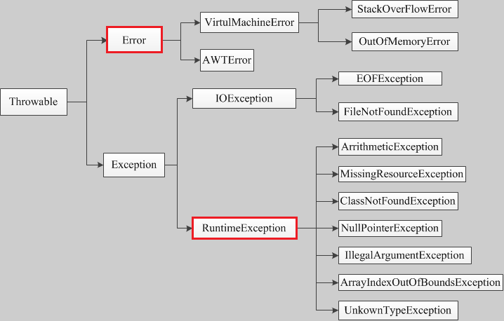

## Java异常类结构图



### Error类以及他的子类的实例，代表了JVM本身的错误。错误不能被程序员通过代码处理
### Exception以及他的子类，代表程序运行时发送的各种不期望发生的事件。可以被Java异常处理机制使用，是异常处理的核心


## unchecked-error 和 checked-error

### unchecked-error：Error 和 RuntimeException 以及他们的子类。javac在编译时，不会提示和发现这样的异常，不要求在程序处理这些异常
### checked-error：除了Error 和 RuntimeException的其它异常。javac强制要求程序员为这样的异常做预备处理工作（使用try...catch...finally或者throws）


## 异常抛出

### throw exceptionObject
```throw new Exception("personal exception")```

## 异常捕获

### throws exception

```
public class Test() throws Exception {
    method body
}
```

### try-catch块
```
try {

} catch(Exception e) {

}
```


## 异常处理
```
try {
    methodbody
} catch(Exception e) {
    exception deal body
} finally {
    do something
}
```

### finally块

#### 对于try-catch-finally块，正常执行顺序是：try-finally，异常执行顺序是：try-catch-finally，不管try和catch是否return，finally都会执行，除非执行了```System.exit()```操作

