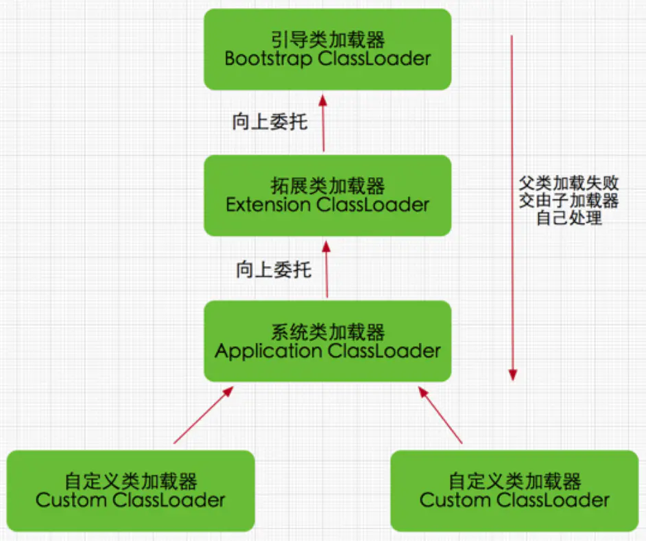

## 字节码形式


### java类源文件
```
public class Test {

    public static void main(String[] args) {
        System.out.println("沉默王二");
    }

}
```

### 编译通过后生成class字节码文件
```
xxd Test.class
00000000: cafe babe 0000 0034 0022 0700 0201 0019  .......4."......
00000010: 636f 6d2f 636d 6f77 6572 2f6a 6176 615f  com/cmower/java_
00000020: 6465 6d6f 2f54 6573 7407 0004 0100 106a  demo/Test......j
00000030: 6176 612f 6c61 6e67 2f4f 626a 6563 7401  ava/lang/Object.
00000040: 0006 3c69 6e69 743e 0100 0328 2956 0100  ..<init>...()V..
00000050: 0443 6f64 650a 0003 0009 0c00 0500 0601  .Code...........
00000060: 000f 4c69 6e65 4e75 6d62 6572 5461 626c  ..LineNumberTabl
```
#### 其中，这段字节码中的 cafe babe 被称为“魔数”，是 JVM 识别 .class 文件的标志


## 类加载过程

### 五个阶段
#### Loading(载入阶段)：将字节码从不同的数据源（可能是 class 文件、也可能是 jar 包，甚至网络）转化为二进制字节流加载到内存中，并生成一个代表该类的 java.lang.Class 对象
#### Verification(验证阶段)：对二进制字节流进行校验，只有符合 JVM 字节码规范的才能被 JVM 正确执行
1. 确保二进制字节流格式符合预期（比如说是否以 cafe bene 开头）
2. 是否所有方法都遵守访问控制关键字的限定
3. 方法调用的参数个数和类型是否正确
4. 确保变量在使用之前被正确初始化了
5. 检查变量是否被赋予恰当类型的值
#### Preparation(准备阶段)：对所有静态变量分配内存并初始化
```
public String chenmo = "沉默";
public static String wanger = "王二";
public static final String cmower = "沉默王二";

wanger会被分配内存，但是其初始值现在还不是"王二"，而是null
```
#### Resolution(解析阶段)：将常量池中的符号引用转化为直接引用
1. 符号引用以一组符号（任何形式的字面量，只要在使用时能够无歧义的定位到目标即可）来描述所引用的目标
2. 直接引用通过对符号引用进行解析，找到引用的实际内存地址
3. 在编译时，Java 类并不知道所引用的类的实际地址，因此只能使用符号引用来代替。比如 com.Wanger 类引用了 com.Chenmo 类，编译时 Wanger 类并不知道 Chenmo 类的实际内存地址，因此只能使用符号 com.Chenmo
#### Initialization(初始化阶段)：在准备阶段，类变量已经被赋过默认初始值，而在初始化阶段，类变量将被赋值为代码期望赋的值

#### PS：这 5 个阶段一般是顺序发生的，但在动态绑定的情况下，解析阶段发生在初始化阶段之后


### 类加载器
#### 对于任意一个类，都需要由它的类加载器和这个类本身一同确定其在 JVM 中的唯一性
#### Java类加载器分为三种
1. 启动类加载器(Bootstrap ClassLoader)：加载 jre/lib 包下面的 jar 文件
2. 扩展类加载器(Extension ClassLoader)：加载 jre/lib/ext 包下面的 jar 文件
3. 应用类加载器(Application Or App ClassLoader)：根据程序的类路径（classpath）来加载 Java 类
#### 每个 Java 类都维护着一个指向定义它的类加载器的引用，通过```类名.class.getClassLoader()```可以获取到该引用，通过```loader.getParent()```可以获取到类加载器的上层类加载器
```
public class Test {

    public static void main(String[] args) {
        ClassLoader loader = Test.class.getClassLoader();
        while (loader != null) {
            System.out.println(loader.toString());
            loader = loader.getParent();
        }
    }
}
```
#### 输出
```
sun.misc.Launcher$AppClassLoader@73d16e93
sun.misc.Launcher$ExtClassLoader@15db9742
```

### 双亲委派模型
#### 如果系统定义的三种类加载器还不满足要求的话，我们还可以自定义类加载器```extends ClassLoader``，这四种类加载器的层级关系如下

#### 这种层级关系也称双亲委派模型，如果一个类加载器收到了加载类的请求，它会先把请求委托给上层加载器去完成，上层加载器又会委托上上层加载器，一直到最顶层的类加载器；如果上层加载器无法完成类的加载工作时，当前类加载器才会尝试自己去加载这个类
#### 双亲委派模型的好处
1. 能够保证同一个类最终会被特定的类加载器加载
2. 可以避免类的重复加载：当父亲已经加载了该类时，就没有必要子ClassLoader再加载一次
#### 安全机制
1. java核心api中定义类型不会被随意替换，假设通过网络传递一个名为java.lang.Integer的类，通过双亲委托模式传递到启动类加载器，而启动类加载器在核心Java API发现这个名字的类，发现该类已被加载，并不会重新加载网络传递的过来的java.lang.Integer，而直接返回已加载过的Integer.class
2. 如果我们在classpath路径下自定义一个名为java.lang.SingleInterge类，是会报错的，因为java.lang是核心API包，需要访问权限，强制加载会抛出异常```java.lang.SecurityException: Prohibited package name: java.lang```


## 参考文献
### [文献1](https://zhuanlan.zhihu.com/p/73078336)
### [文献2](https://www.jianshu.com/p/9df9d318e838)
