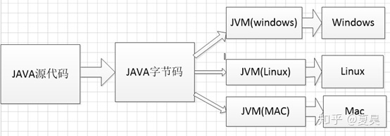

## 跨平台概述

### 每一个操作系统平台支持不同的指令集我们所写的代码经过编译之后只能适用于一个平台，换一个平台就不支持了。而JAVA完美的解决了这个问题，JAVA是如何做到这一点的呢？在上图中我们可以看到JAVA代码执行的流程

## 跨平台原理
### java代码执行流程
#### JAVA源代码->JAVA字节码->JVM解释执行
### 原理
#### 我们写的JAVA源代码会被编译为字节码，然后被JVM虚拟机解释执行，我们可以看到JVM虚拟机在跨平台的过程中发挥了重要的作用，就是由它解释字节码并执行的，对应于每一个平台都有一个JVM虚拟机，而字节码只有一份，windows的JVM虚拟机可以将字节码解释为能在windows平台上执行的指令并执行，Linux的JVM虚拟机可以将字节码解释为能在Linux平台上执行的指令并执行，他们执行的字节码都是同一份。这样就实现了跨平台