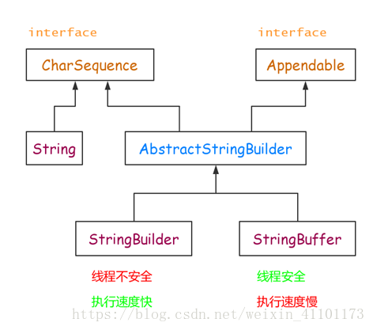

## 区别总结

### String类是不可变类，任何对String的改变都 会引发新的String对象的生成
### StringBuffer则是可变类，任何对它所指代的字符串的改变都不会产生新的对象，而且其所有的操作都是线程安全的(使用synchronize方法)
### StringBuilder 类在 Java 5 中被提出，它和 StringBuffer 之间的最大不同在于 StringBuilder 的方法不是线程安全的

## 三者继承结构

### 

## 参考文献

### [文献1](https://blog.csdn.net/qq_41021836/article/details/81746114?utm_medium=distribute.pc_relevant_t0.none-task-blog-2%7Edefault%7EBlogCommendFromMachineLearnPai2%7Edefault-1.control&dist_request_id=1328767.24368.16174199641303361&depth_1-utm_source=distribute.pc_relevant_t0.none-task-blog-2%7Edefault%7EBlogCommendFromMachineLearnPai2%7Edefault-1.control)