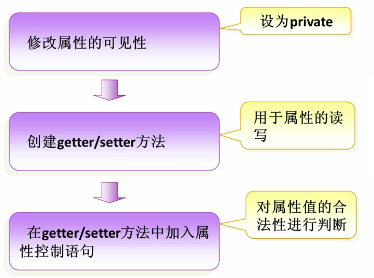
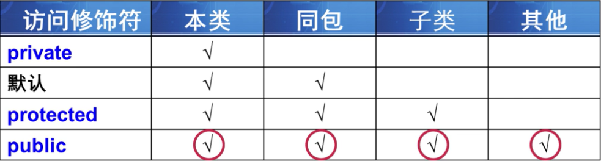
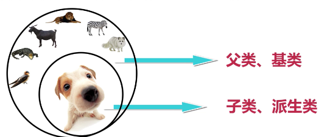

## 封装

### 将类的某些信息封装在内部，不允许外部程序直接访问，而是通过类提供的方法来间接访问这些信息，如get/set方法


### 访问修饰符分类


### java提供了一种内部类来实现更好的封装，内部类分为几种

#### 成员内部类

#### 静态内部类

#### 方法内部类

#### 匿名内部类

### [内部类详细讲解](../Java内部类/Java内部类.md)


## 继承

### 类之间的一种关系，java允许单继承、多实现


### 子类重写父类方法要求：

#### 方法名要相同
#### 返回值类型要相同
#### 参数类型要一一对应相同

### PS：注意重写和重载的区别：
#### 重写：相对于继承而言，子类对父类中已存在的方法进行区别化修改
#### 重载：在同一个类中处理名字相同参数不同的方法的多态手段

### 继承的初始化顺序

#### 父类对象属性初始化---->父类对象构造方法---->子类对象属性初始化--->子类对象构造方法
#### 如果在子类的构造器中没有显式调用父类的构造器，则默认调用父类的无参构造器进行初始化

### final关键字

#### 修饰类：不可变类，不允许被继承
#### 修饰方法：不允许被重写
#### 修饰属性：定义的时候必须初始化，且只能被初始化一次
#### 修饰变量：只能赋值一次，赋值以后跟常量差不多

### super关键字

#### 在对象的内部使用，可以代表父类对象


## 多态

### 引用多态

#### 父类的引用可以指向本类的对象
#### 父类的引用可以指向子类的对象

### PS：一个子类的引用来指向父类的对象是不可行的！！！

### 方法调用的多态

#### 创建本类对象时，调用的方法为本类方法
#### 创建子类对象时，调用的方法为子类重写的方法或者继承的方法

### PS：如果我们在子类中编写一个独有的方法（没有继承父类的方法），此时就不能通过父类的引用创建的子类对象来调用该方法！！！

### 引用类型转换

#### 向上转型： 子类赋值给父类，此时可以正常转型，如：
```
Dog dog = new Dog();
Animals animal = dog;
```

#### 向下转型： 父类赋值给子类，此时编译器不允许直接这么做，需要进行强制类型转换，如：
```
Animals animal = new Animals();
// Dog dog = animal;  编译会报错
Dog dog = (Dog) animal;
```

### 引用对象类型判断

#### instanceof：判断左边对象是否为右边类的实例或者右边类的派生类的实例

### 抽象类和接口

#### 抽象类
```
public abstract Test {
    
    // 未实现的方法必须使用abstract关键字
    public abstract void open();
    
    // 可以包含实现的方法
    public void close() {
        System.out.print("welcome to China");
    }
}
```

#### 接口
```
public interface Test {

    // 常量只能定义全局静态
    public static final int var = 1;
    
    // 1.8以前必须都是抽象方法
    public abstract void open();
     
   // 1.8以后可以有默认方法
   default void print() {
        System.out.print("welcome to China");
   }
}
```