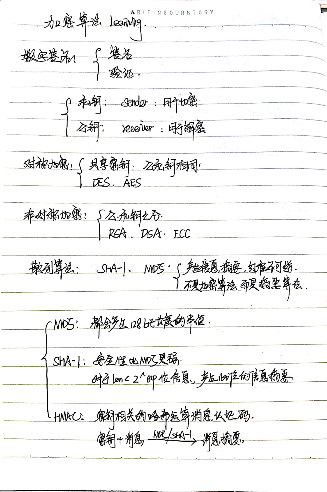
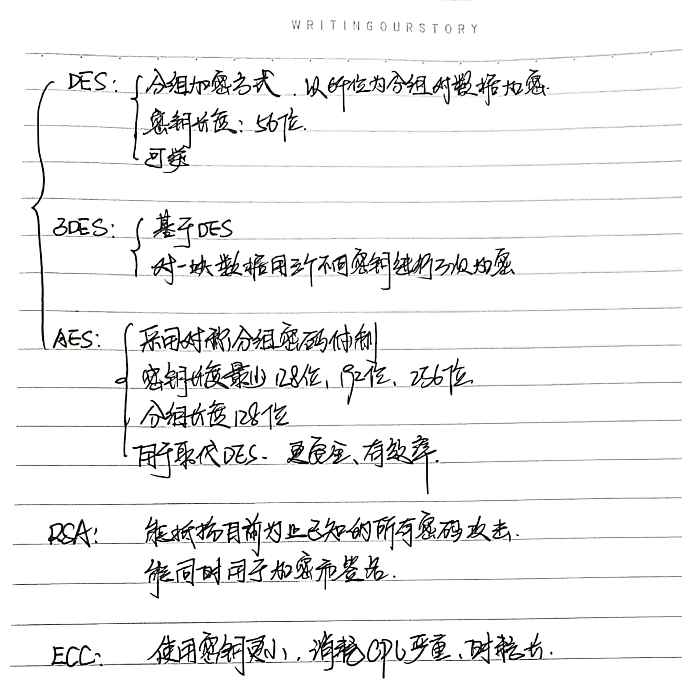
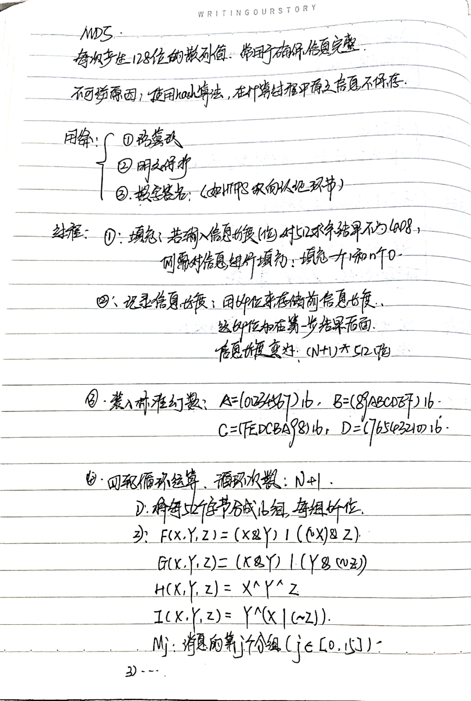

## 1. 基本概念

### [参考博客](https://blog.csdn.net/baidu_22254181/article/details/82594072)

## 2. 摘要算法：MD5

### [参考博客](https://blog.csdn.net/u012611878/article/details/54000607)

## 3. 摘要算法：SHA-1

## 4. 对称加密算法：DES

## 5. 对称加密算法：AES

## 6. 非对称加密算法：RSA

## 7. 非对称加密算法：DSA

## 8. 非对称加密算法：ECC