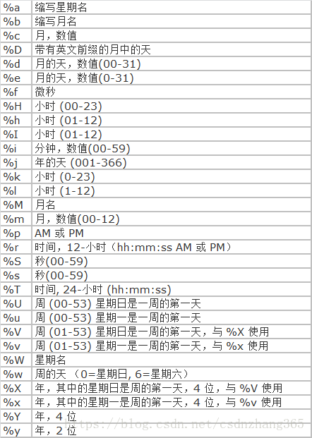

## 数值类型

## 浮点类型

### 定点数以字符串形式存储，对精度要求高时使用decimal较好；尽量避免对浮点数进行减法和比较运算

## 时间类型

### 时间格式化字符

## 字符类型

### blog-二进制大对象，用来存储可变数量的数据

### 字符串编码
1. ASCII编码，一个英文字母占一个字节的空间，一个中文占两个字节的空间
2. UTF-8编码中，一个英文字符占一个字节，一个中文占三个字节
3. Unicode编码中，一个英文占两个字节，一个中文占两个字节

### char和varchar区别
#### char是定长字符串，char(8)，存储的时候如果长度小于8，则会在其后补空格至8位存储，查询的结果不会包含补充的空格
#### varchar是变长字符串，varchar(8)，则是存入的实际长度+1(n<=255)或2(n>255)
#### char类型的字符串检索要比varchar类型的快
#### 空间上考虑，用varchar合适；效率上考虑，用char合适

## MySQL与Java对应类型

## 参考文献
### [文献1](https://blog.csdn.net/csdnzhang365/article/details/80591987)