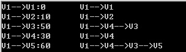
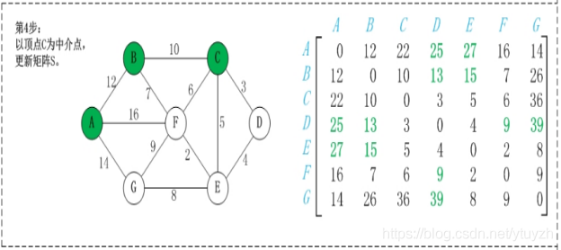

## Dijkstra算法(银行家算法)
### 概述图
#### 
#### 
### 算法实现
```
#include <stdio.h>
 
#define M	65535 //无穷大
#define N	5 //顶点数
 
//Dijkstra算法函数，求给定顶点到其余各点的最短路径
//参数：邻接矩阵、出发点的下标、结果数组、路径前一点记录
void Dijkstra(int Cost[][N], int v0, int Distance[], int prev[])
{
    int s[N];
    int mindis,dis;
    int i, j, u;
    //初始化
    for(i=0; i<N; i++)
    {
        Distance[i] = Cost[v0][i];
        s[i] = 0;
        if(Distance[i] == M)
			prev[i] = -1;
        else
			prev[i] = v0;
    }
    Distance[v0] = 0;
    s[v0] = 1; //标记v0
    //在当前还未找到最短路径的顶点中，
    //寻找具有最短距离的顶点
    for(i=1; i < N; i++)
    {//每循环一次，求得一个最短路径
        mindis = M;
        u = v0;
        for (j=0; j < N; j++) //求离出发点最近的顶点
			if(s[j]==0 && Distance[j]<mindis)
			{
				mindis = Distance [j];
				u = j;
			} // if语句体结束，j循环结束
        s[u] = 1;
        for(j=0; j<N; j++) //修改递增路径序列（集合）
        if(s[j]==0 && Cost[u][j]<M)
        { //对还未求得最短路径的顶点
            //求出由最近的顶点 直达各顶点的距离
            dis = Distance[u] +Cost[u][j];
            // 如果新的路径更短，就替换掉原路径
 
            if(Distance[j] > dis)
            {
                Distance[j] = dis;
                prev[j] = u;
            }
        } // if 语句体结束，j循环结束
    } // i循环结束
}
// 输出最短路径
// 参数：路径前一点记录、出发点的下标、到达点下标
void PrintPrev(int prev[],int v0,int vn)
{
    int tmp = vn;
    int i, j;
    //临时存路径
    int tmpprv[N];
    //初始化数组
    for(i=0; i < N; i++)
		tmpprv[i] = 0;
 
    //记录到达点下标
    tmpprv[0] = vn+1;
    //中间点用循环记录
    for(i =0, j=1; j < N ;j++)
    {
        if(prev[tmp]!=-1 && tmp!=0)
        {
            tmpprv[i] = prev[tmp]+1;
            tmp = prev[tmp];
            i++;
        }
        else break;
    }
 
    //输出路径，数组逆向输出
    for(i=N-1; i >= 0; i--)
    {
        if(tmpprv[i] != 0)
        { //排除0元素
            printf("V%d", tmpprv[i]);
            if(i)  //不是最后一个输出符号 
                printf("-->");
        }
    }
	printf("-->V%d", vn+1);
}
//主函数
int main()
{
    //给出有向网的顶点数组
    char *Vertex[N]={"V1", "V2", "V3", "V4", "V5"};
    //给出有向网的邻接矩阵
    int Cost[N][N]={
		{0, 10, M, 30, 100},
        {M, 0, 50, M, M},
        {M, M, 0, M, 10},
        {M, M, 20, 0, 60},
        {M, M, M, M, 0},
    };
    int Distance[N]; //存放求得的最短路径长度
    int prev[N];  //存放求得的最短路径
	int i;
    //调用Dijkstra算法函数，求顶点V1到其余各点的最短路径
    //参数：邻接矩阵、顶点数、出发点的下标、 结果数组
    Dijkstra(Cost, 0, Distance, prev);
    for(i=0; i < N; i++)
    {
        //输出最短路径长度
        printf("%s-->%s:%d\t", Vertex[0], Vertex[i], Distance[i]);
        //输出最短路径
        PrintPrev(prev, 0, i);
        printf("\n");
    }
 
    return 0;
}
```
#### 代码运行结果


## Floyd算法(弗洛伊德算法)
### 实现细节(无向图)
#### map（i，j）表示节点i到j最短路径的距离
#### 初始化map矩阵：矩阵中map[i][j]的距离为顶点i到顶点j的权值或者∞或者0(i==j)
#### 以顶点A(假设是第1个顶点)为中介点，若a[i][j] > a[i][1]+a[1][j]，则设置a[i][j]=a[i][1]+a[1][j]
#### 
#### 
#### 
#### 
#### 
#### 
#### 
#### 
### 核心代码(无向图)
#### 
### 实现代码(无向图)
```
#define NUMS 12   
#define INF 65535
 
typedef struct  
{   
    	char vertex[NUMS];   
    	int edges[NUMS][NUMS];   
    	int n,e;   
}Graph;      
 
void Floyd(Graph G)
{
	int map[NUMS][NUMS];
	int i,j,k;
	for (i=0;i<G.n;i++)
	{
		for (j=0;j<G.n;j++)
		{
			map[i][j] = i==j ? 0 : G.edges[i][j];
		}
	}
	for (k=0;k<G.n;k++)
	{
		for (i=0;i<G.n;i++)
		{
			for (j=0;j<G.n;j++)
			{
				if (map[i][j]>map[i][k]+map[k][j])
				{
					map[i][j]=map[i][k]+map[k][j];
				}
			}
		}
	}
}
```
### 实现细节(有向图)
#### 
#### 
#### 
#### 
#### 
#### 
#### 
#### 
### 核心代码(有向图)
#### 
### 实现代码(有向图)
```
#define NUMS 12   
#define INF 65535
 
typedef struct  
{   
    	char vertex[NUMS];   
    	int edges[NUMS][NUMS];   
    	int n,e;   
}Graph;   
 
void Dispath(int A[][NUMS],int path[][NUMS],int n);    
 
void Floyd(Graph G)
{
	int A[NUMS][NUMS],path[NUMS][NUMS];
	int i,j,k;
	for (i=0;i<G.n;i++)
	{
		for (j=0;j<G.n;j++)
		{
			A[i][j]=G.edges[i][j];
			path[i][j]=-1;
		}
	}
	for (k=0;k<G.n;k++)
	{
		for (i=0;i<G.n;i++)
		{
			for (j=0;j<G.n;j++)
			{
				if (A[i][j]>A[i][k]+A[k][j])
				{
					A[i][j]=A[i][k]+A[k][j];
					path[i][j]=k;
				}
			}
		}
	}
	Dispath(A,path,G.n);
}
 
void Ppath(int path[][NUMS],int i,int j)
{
	int k;
	k=path[i][j];
	if (k==-1)
	{
		return;
	}
	Ppath(path,i,k);
	printf("%d,",k + 1);
	Ppath(path,k,j);
}
 
void Dispath(int A[][NUMS],int path[][NUMS],int n)
{
	int i,j;
	for (i=0;i<n;i++)
	{
		for (j=0;j<n;j++)
		{
			if (A[i][j]==INF)
			{
				if (i!=j)
				{
					printf("从%d到%d没有路径\n",i+1,j+1);
				}
			}
			else
			{
				printf(" 从%d 到 %d => 最短路径长度为 : %d , 路径站点为 :",i+1,j+1,A[i][j]);
				printf("%d,",i + 1);
				Ppath(path,i,j);
				printf("%d\n",j + 1);
			}
		}
	}
}
```

## 参考文献
### [Dijkstra](https://blog.csdn.net/laoniu_c/article/details/38455255)
### [Floyd](https://blog.csdn.net/ytuyzh/article/details/88617987)
