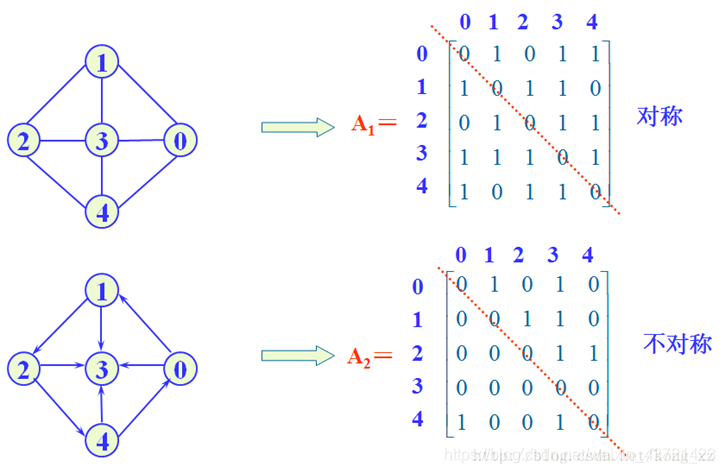

## 邻接矩阵
### 
```
#define MAXV <最大顶点个数>

/* 顶点类型 */
typedef struct {
    int no;         //顶点编号
    InfoType info;  //顶点其它信息
}VertexType;

/* 完整的图邻接矩阵类型 */
typedef struct {
    int edges[MAXV][MAXV];
    int edgeNum,vexNum; // 边数，顶点树
    VertexType vexs[MAXV];
}MatGraph;

```

## 邻接表
### 
```
/* 边结点类型 */
typedef struct ANode{
    int adjvex;                 //该边的邻接点编号
    struct ANode * nextarc;     //指向下一条边的指针
    int weight;                 //该边的权值
}ArcNode;

/* 头结点类型 */
typedef struct{
    InfoType info;            //顶点信息
    ArcNode* firstarc;        //指向第一个邻接点
}VNode;

/* 完整的图邻接表类型 */
typedef struct {
    VNode adjlist[MAXV];    //邻接表的头节点数组
    int vexNum,arcNum;      //图中的顶点数vexNum和边数arcNum
}AdjGraph;

```