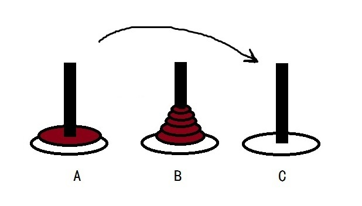

## 1. 斐波那契数列
### 难度：简单
### 介绍：

### 实现代码：
#### [递归](Coding/Fibonacci/recursion.c)
#### [非递归](Coding/Fibonacci/non_recursion.c)

## 2. 汉诺塔
### 难度：中等
### 介绍：

### 实现代码：
#### [递归](Coding/Hanoi/recursion.c)
#### [非递归](Coding/Hanoi/non_recursion.c)