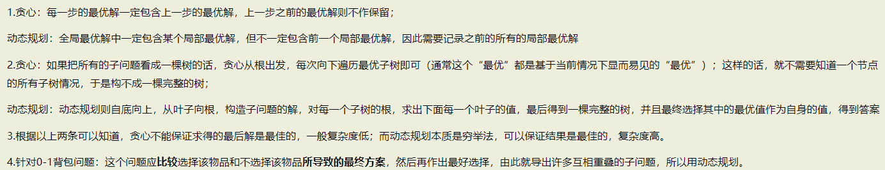

## 1. 什么是贪心
### 在对问题求解时，总是做出在当前看来是最好的选择。也就是说，不从整体最优上加以考虑，算法得到的是在某种意义上的局部最优解(引自百度百科)

## 2. 常见题型
### 小数背包问题
### 单源最短路径问题
### 最小成本生成树问题

## 3. 解题思路
### a. 建立数学模型来描述问题
### b. 把求解的问题分成若干个子问题
### c. 对每个子问题进行求解，得到子问题的局部最优解
### d. 把子问题的最优解整合成原来问题的一个解

## 4. 贪心和动态规划的区别(主要说明01背包问题和小数背包问题)

### [原文链接](https://www.cnblogs.com/Joezzz/p/9716193.html)
### 小数背包问题：背包一定是装满的，因为物品可以任意分割
### 01背包问题：最优解背包不一定满