## 前言 - 红黑树

### 红黑树性质
#### 每个节点要么是红色，要么是黑色
#### 根节点必须为黑色
#### 红色节点不可以连续 (红色节点的孩子不能为红色)
#### 对于每个节点，从该节点到 null （树尾端）的任何路径，都含有相同个数的黑色节点
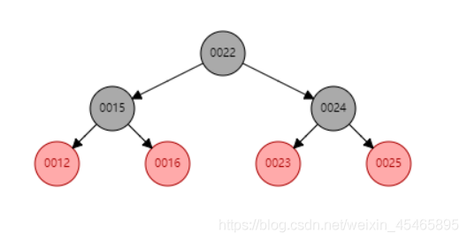

### 1.8为什么要加入红黑树
#### 当链表长度比较长了的时候，去存储数据、读取数据都需要不停的去遍历循环，所以此时再采用链表结构的话效率会明显下降，所以JDK1.8之后做了优化，当链表的长度大于8的时候就由链表转为红黑树来存储。红黑树是平衡二叉树的其中一种实现，它比普通的二叉树表现更优异，因为普通的查询二叉树在一定条件下也可能会变成链表结构，而红黑树它是平衡二叉树的一种，它是通过左旋右旋变色等保持树的平衡。

### 基本操作
#### 变色
1. 可以看到左侧的红黑树不满足性质3,，因此进行图一右侧转变
2. 变色后发现又违背了性质4，于是进行图二右侧转变
3. 变色后发现还是不满足性质3和性质4，于是进行图三右侧转变，最终满足所有性质，成功变色

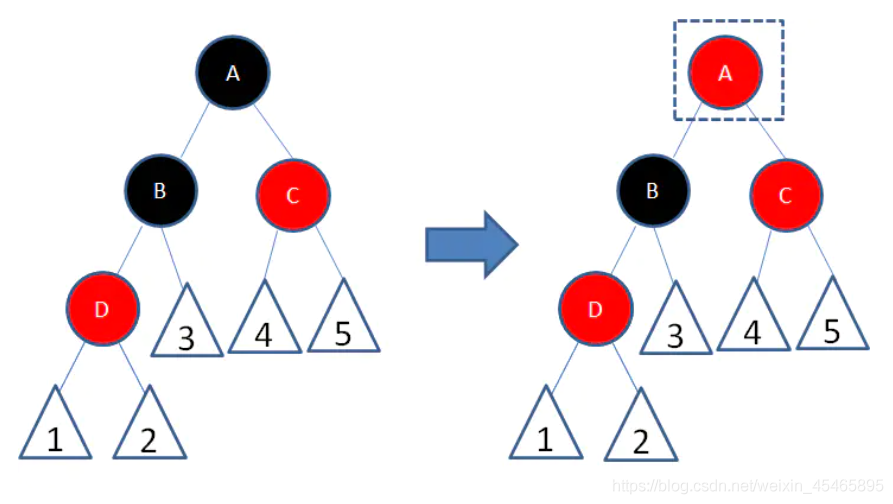
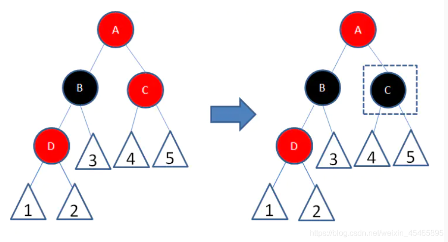

#### 旋转
1. 左旋：图一，自己的右子节点成为自己的父节点，自己右子节点的左子节点变成了自己的右子节点
2. 右旋：图二，自己的左子节点成为自己的父节点，自己左子节点的右子节点变成了自己的左子节点
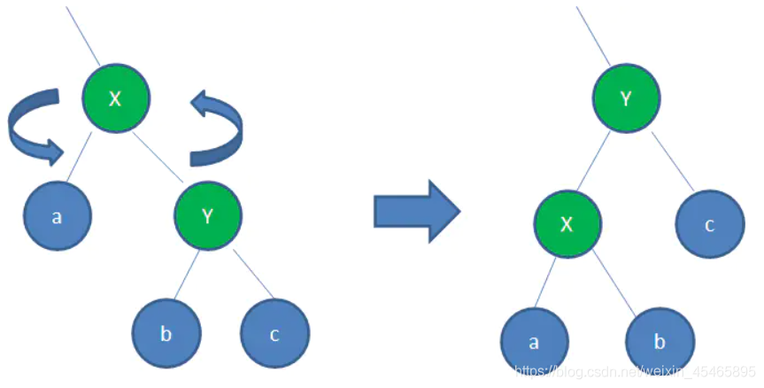
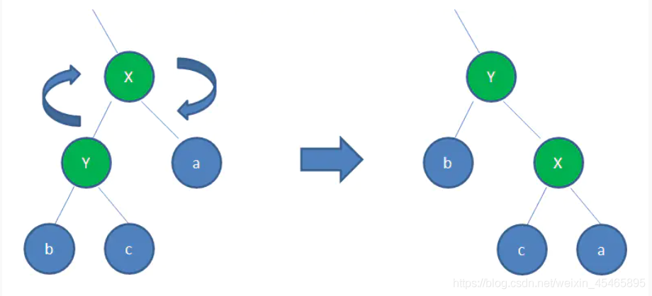


## HashMap结构图

### 1.8以前
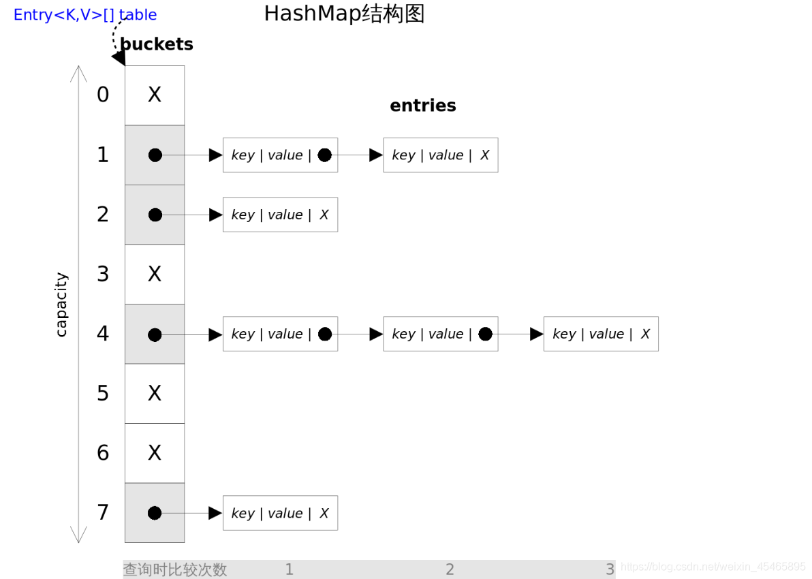

### 1.8
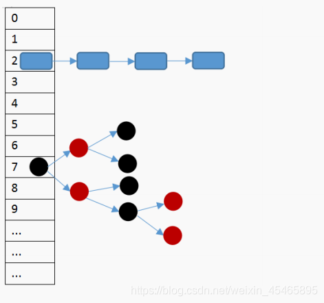


## HashMap扩容
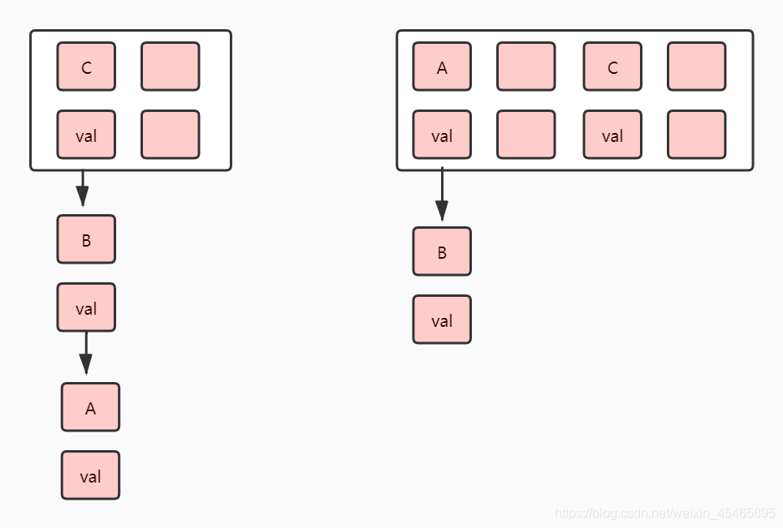
### 为什么C的下标变了？ 这是因为元素的数组索引位置是由key的hash值和数组的长度决定的
### 那是不是每次resize扩容都需要把所有的key都获取一遍hash？1.8以后不用了，Node类新增hash成员变量


## HashMap的modcount的作用
```
/**
 * The number of times this HashMap has been structurally modified
 * Structural modifications are those that change the number of mappings in
 * the HashMap or otherwise modify its internal structure (e.g.,
 * rehash).  This field is used to make iterators on Collection-views of
 * the HashMap fail-fast.  (See ConcurrentModificationException).
 */
transient int modCount;
```
### Fast-Fail机制
#### java.util.HashMap 不是线程安全的，因此如果在使用迭代器的过程中有其他线程修改了map，那么将抛出ConcurrentModificationException，这就是所谓fail-fast机制
### jdk1.7以前modcount使用volatile关键字修饰，1.7移除了volatile关键字，那么是如何保证fast-fail机制呢
#### HashMap.HashIterator
```
private abstract class HashIterator<E> implements Iterator<E> {
        Entry<K,V> next;        // next entry to return
        int expectedModCount;   // For fast-fail
        int index;              // current slot
        Entry<K,V> current;     // current entry

        HashIterator() {
            expectedModCount = modCount;
            if (size > 0) { // advance to first entry
                Entry[] t = table;
                while (index < t.length && (next = t[index++]) == null)
                    ;
            }
        }
        
        final Entry<K,V> nextEntry() {
            if (modCount != expectedModCount)
                throw new ConcurrentModificationException();
            Entry<K,V> e = next;
}
```
#### 在对Key或者Value进行iterator()遍历的时候，会将对应的modCount记录下来，然后在遍历过程中会进行比较，如果expectedModCount与modCount不相等，则抛出```ConcurrentModificationException```


## HashMap.hash()
```
    static final int hash(Object key) {
        int h;
        return (key == null) ? 0 : (h = key.hashCode()) ^ (h >>> 16);
    }
```
### 为什么要无符号右移16位后做异或运算？key本身的hashCode直接拿来用不好吗？
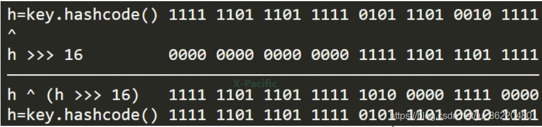
#### 我们可知通过上面(h = key.hashCode()) ^ (h >>> 16)进行运算可以把高区与低区的二进制特征混合到低区，那么为什么要这么做呢？
#### 我们都知道重新计算出的新哈希值在后面将会参与hashmap中数组槽位的计算，计算公式：(n - 1) & hash，假如这时数组槽位有16个，则槽位计算如下
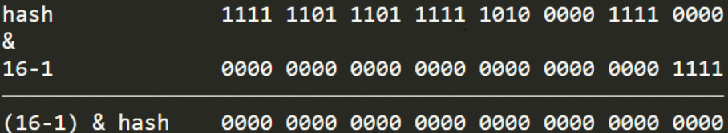
#### 仔细观察上文不难发现，高区的16位很有可能会被数组槽位数的二进制码锁屏蔽，如果我们不做刚才移位异或运算，那么在计算槽位时将丢失高区特征
#### 也许你可能会说，即使丢失了高区特征不同hashcode也可以计算出不同的槽位来，但是细想当两个哈希码很接近时，那么这高区的一点点差异就可能导致一次哈希碰撞，所以这也是将性能做到极致的一种体现

### 使用^运算的原因
#### 异或运算能更好的保留各部分的特征，如果采用&运算计算出来的值会向1靠拢，采用|运算计算出来的值会向0靠拢

### 为什么槽位数必须使用2^n？
#### 为了让哈希后的结果更加均匀，试想上述例子如果不是16而是17，则槽位计算如下
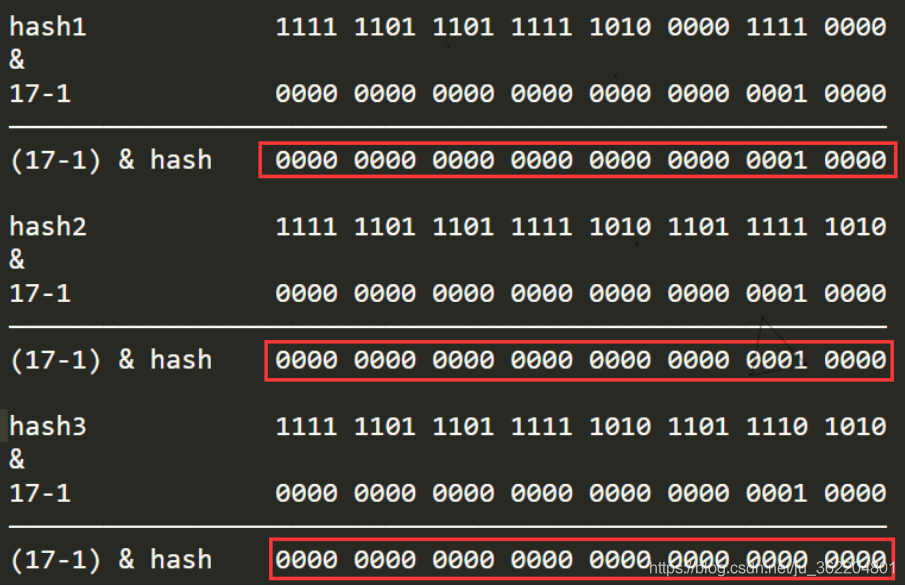
#### hashcode参与&运算会被更多的0屏蔽，最终槽位结果只会为0或16，对hashmap来说是一个大灾难
#### 其最终目的还是为了让hashcode均匀分布


## 使用注意事项

### 如果是自定义类型作为 HashMap 的 key 时候，这个时候需要覆盖 hashCode 和 equals 方法
### HashMap的初始化是在插入第一个元素时调用resize完成的
### 指定容量不一定按照你的值来，会经过tableSizeFor转成不小于输入值的2的n次幂
### put元素时，元素的位置取决于数组的长度和key的hash值按位与的结果i = (n - 1) & hash


## 参考文献
### [文献1](https://blog.csdn.net/ywlmsm1224811/article/details/91388815)
### [文献2](https://blog.csdn.net/moneywenxue/article/details/110457302)