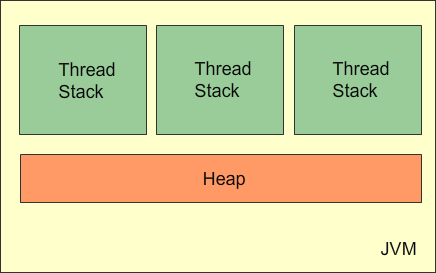
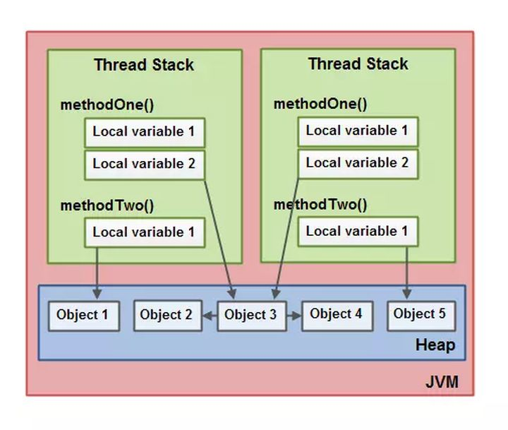
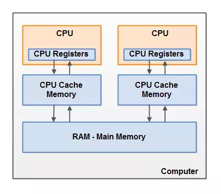
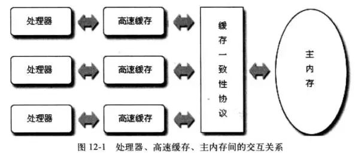
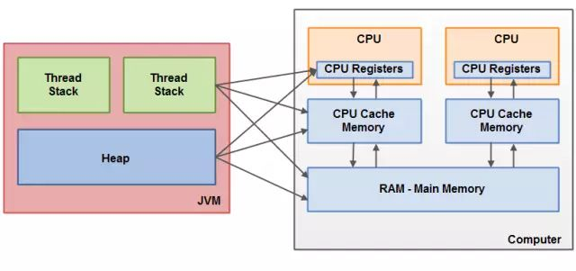
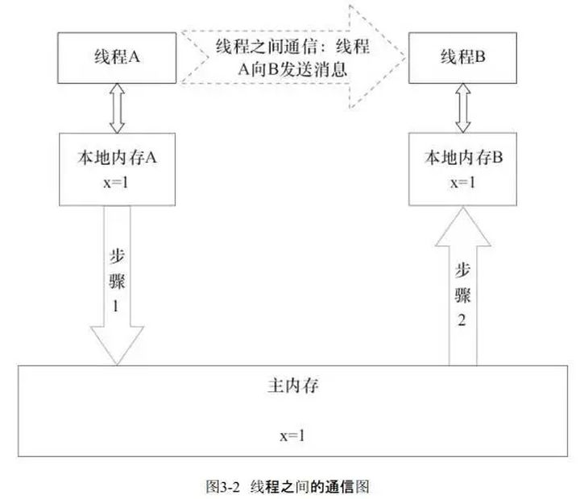
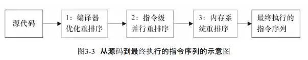
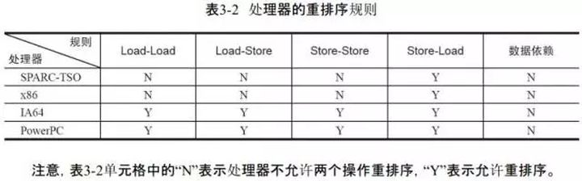
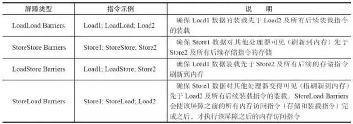
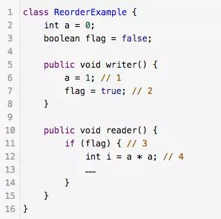

## 概述

### 用于屏蔽掉各种硬件和操作系统的内存访问差异，以实现让Java程序在各种平台下都能达到一致的并发效果
### 规范了Java虚拟机与计算机内存是如何协同工作的：规定了一个线程如何和何时可以看到由其他线程修改过后的共享变量的值，以及在必须时如何同步的访问共享变量

#### 一个本地变量可能是原始类型，在这种情况下，它总是“呆在”线程栈上
#### 一个本地变量也可能是指向一个对象的一个引用。在这种情况下，引用（这个本地变量）存放在线程栈上，但是对象本身存放在堆上
#### 一个对象可能包含方法，这些方法可能包含本地变量。这些本地变量仍然存放在线程栈上，即使这些方法所属的对象存放在堆上
#### 一个对象的成员变量可能随着这个对象自身存放在堆上。不管这个成员变量是原始类型还是引用类型
#### 静态成员变量跟随着类定义一起也存放在堆上
#### 存放在堆上的对象可以被所有持有对这个对象引用的线程访问。当一个线程可以访问一个对象时，它也可以访问这个对象的成员变量。如果两个线程同时调用同一个对象上的同一个方法，它们将会都访问这个对象的成员变量，但是每一个线程都拥有这个成员变量的私有拷贝

## 硬件内存架构

### 多CPU
#### 在一个有两个或者多个CPU的现代计算机上同时运行多个线程是可能的
#### 如果你的Java程序是多线程的，在你的Java程序中每个CPU上多个线程可能同时（并发）执行
### CPU寄存器
#### CPU在寄存器上执行操作的速度远大于在主存上执行的速度
### 高速缓存Cache
#### 由于计算机的存储设备与处理器的运算速度之间有着几个数量级的差距，所以现代计算机系统都不得不加入一层读写速度尽可能接近处理器运算速度的高速缓存（Cache）来作为内存与处理器之间的缓冲：将运算需要使用到的数据复制到缓存中，让运算能快速进行，当运算结束后再从缓存同步回内存之中，这样处理器就无须等待缓慢的内存读写了
#### CPU访问缓存层的速度快于访问主存的速度，但通常比访问内部寄存器的速度还要慢一点。每个CPU可能有一个CPU缓存层，一些CPU还有多层缓存。在某一时刻，一个或者多个缓存行（cache lines）可能被读到缓存，一个或者多个缓存行可能再被刷新回主存
### 内存
### 运作原理
#### 通常情况下，当一个CPU需要读取主存时，它会将主存的部分读到CPU缓存中。它甚至可能将缓存中的部分内容读到它的内部寄存器中，然后在寄存器中执行操作。当CPU需要将结果写回到主存中去时，它会将内部寄存器的值刷新到缓存中，然后在某个时间点将值刷新回主存。

## 面临的问题

### 缓存一致性问题
#### 当多个处理器的运算任务都涉及同一块主内存区域时，将可能导致各自的缓存数据不一致的情况，如果真的发生这种情况，那同步回到主内存时以谁的缓存数据为准呢？

### 指令重排序问题
#### 为了使得处理器内部的运算单元能尽量被充分利用，处理器可能会对输入代码进行乱序执行（Out-Of-Order Execution）优化，处理器会在计算之后将乱序执行的结果重组，保证该结果与顺序执行的结果是一致的，但并不保证程序中各个语句计算的先后顺序与输入代码中的顺序一致。因此，如果存在一个计算任务依赖另一个计算任务的中间结果，那么其顺序性并不能靠代码的先后顺序来保证

## Java内存模型和硬件内存架构之间的桥接

### 硬件内存架构没有区分线程栈和堆。对于硬件，所有的线程栈和堆都分布在主内存中，部分线程栈和堆可能有时候会出现在CPU缓存中和CPU内部的寄存器中
### JMM定义的抽象关系
1. 线程之间的共享变量存储在主内存（Main Memory）中
2. 每个线程都有一个私有的本地内存（Local Memory），本地内存是JMM的一个抽象概念，并不真实存在，它涵盖了缓存、写缓冲区、寄存器以及其他的硬件和编译器优化。本地内存中存储了该线程以读/写共享变量的拷贝副本

## Java内存模型下线程间的通信

### Java内存模型定义了以下八种操作来完成一个变量从主内存拷贝到工作内存、从工作内存同步到主内存
#### lock（锁定）：作用于主内存的变量，把一个变量标识为一条线程独占状态。
#### unlock（解锁）：作用于主内存变量，把一个处于锁定状态的变量释放出来，释放后的变量才可以被其他线程锁定。
#### read（读取）：作用于主内存变量，把一个变量值从主内存传输到线程的工作内存中，以便随后的load动作使用
#### load（载入）：作用于工作内存的变量，它把read操作从主内存中得到的变量值放入工作内存的变量副本中。
#### use（使用）：作用于工作内存的变量，把工作内存中的一个变量值传递给执行引擎，每当虚拟机遇到一个需要使用变量的值的字节码指令时将会执行这个操作。
#### assign（赋值）：作用于工作内存的变量，它把一个从执行引擎接收到的值赋值给工作内存的变量，每当虚拟机遇到一个给变量赋值的字节码指令时执行这个操作。
#### store（存储）：作用于工作内存的变量，把工作内存中的一个变量的值传送到主内存中，以便随后的write的操作。
#### write（写入）：作用于主内存的变量，它把store操作从工作内存中一个变量的值传送到主内存的变量中。

### Java内存模型还规定了在执行上述八种基本操作时，必须满足如下规则
#### 如果要把一个变量从主内存中复制到工作内存，就需要按顺寻地执行read和load操作， 如果把变量从工作内存中同步回主内存中，就要按顺序地执行store和write操作。但Java内存模型只要求上述操作必须按顺序执行，而没有保证必须是连续执行。
#### 不允许read和load、store和write操作之一单独出现
#### 不允许一个线程丢弃它的最近assign的操作，即变量在工作内存中改变了之后必须同步到主内存中。
#### 不允许一个线程无原因地（没有发生过任何assign操作）把数据从工作内存同步回主内存中。
#### 一个新的变量只能在主内存中诞生，不允许在工作内存中直接使用一个未被初始化（load或assign）的变量。即就是对一个变量实施use和store操作之前，必须先执行过了assign和load操作。
#### 一个变量在同一时刻只允许一条线程对其进行lock操作，但lock操作可以被同一条线程重复执行多次，多次执行lock后，只有执行相同次数的unlock操作，变量才会被解锁。lock和unlock必须成对出现
#### 如果对一个变量执行lock操作，将会清空工作内存中此变量的值，在执行引擎使用这个变量前需要重新执行load或assign操作初始化变量的值
#### 如果一个变量事先没有被lock操作锁定，则不允许对它执行unlock操作；也不允许去unlock一个被其他线程锁定的变量。
#### 对一个变量执行unlock操作之前，必须先把此变量同步到主内存中（执行store和write操作）。

## Java内存模型解决的问题

### 多线程读同步与可见性
#### 线程缓存导致的可见性问题
如果两个或者更多的线程在没有正确的使用volatile声明或者同步的情况下共享一个对象，一个线程更新这个共享对象可能对其它线程来说是不可见的：共享对象被初始化在主存中。跑在CPU上的一个线程将这个共享对象读到CPU缓存中，然后修改了这个对象。只要CPU缓存没有被刷新会主存，对象修改后的版本对跑在其它CPU上的线程都是不可见的。这种方式可能导致每个线程拥有这个共享对象的私有拷贝，每个拷贝停留在不同的CPU缓存中
#### 解决办法
1. Java中的volatile关键字：volatile关键字可以保证直接从主存中读取一个变量，如果这个变量被修改后，总是会被写回到主存中去。Java内存模型是通过在变量修改后将新值同步回主内存，在变量读取前从主内存刷新变量值这种依赖主内存作为传递媒介的方式来实现可见性的，无论是普通变量还是volatile变量都是如此，普通变量与volatile变量的区别是：volatile的特殊规则保证了新值能立即同步到主内存，以及每个线程在每次使用volatile变量前都立即从主内存刷新。因此我们可以说volatile保证了多线程操作时变量的可见性，而普通变量则不能保证这一点
2. Java中的synchronized关键字：同步快的可见性是由“如果对一个变量执行lock操作，将会清空工作内存中此变量的值，在执行引擎使用这个变量前需要重新执行load或assign操作初始化变量的值”、“对一个变量执行unlock操作之前，必须先把此变量同步回主内存中（执行store和write操作）”这两条规则获得的
3. Java中的final关键字：final关键字的可见性是指，被final修饰的字段在构造器中一旦被初始化完成，并且构造器没有把“this”的引用传递出去（this引用逃逸是一件很危险的事情，其他线程有可能通过这个引用访问到“初始化了一半”的对象），那么在其他线程就能看见final字段的值（无须同步）
#### 重排序导致的可见性问题
Java程序中天然的有序性可以总结为一句话：如果在本地线程内观察，所有操作都是有序的（“线程内表现为串行”(Within-Thread As-If-Serial Semantics)）；如果在一个线程中观察另一个线程，所有操作都是无序的（“指令重排序”现象和“线程工作内存与主内存同步延迟”现象）
#### 重排序分类
1. 编译器优化的重排序。编译器在不改变单线程程序语义的前提下，可以重新安排语句的执行顺序
2. 指令级并行的重排序。现代处理器采用了指令级并行技术（Instruction-LevelParallelism，ILP）来将多条指令重叠执行。如果不存在数据依赖性，处理器可以改变语句对应机器指令的执行顺序
3. 内存系统的重排序。由于处理器使用缓存和读/写缓冲区，这使得加载和存储操作看上去可能是在乱序执行

#### 保证线程之间操作的有序性方法
1. volatile关键字本身就包含了禁止指令重排序的语义
2. synchronized则是由“一个变量在同一个时刻只允许一条线程对其进行lock操作”这条规则获得的，这个规则决定了持有同一个锁的两个同步块只能串行地进入
3. Java编译器在生成指令序列的适当位置也会插入内存屏障指令来禁止特定类型的处理器重排序

#### as-if-serial语义
不管怎么重排序（编译器和处理器为了提高并行度），（单线程）程序的执行结果不能被改变。（编译器、runtime和处理器都必须遵守as-if-serial语义）
#### happens before：在JMM中，如果一个操作执行的结果需要对另一个操作可见（两个操作既可以是在一个线程之内，也可以是在不同线程之间），那么这两个操作之间必须要存在happens-before关系：
1. 程序顺序规则：一个线程中的每个操作，happens-before于该线程中的任意后续操作
2. 监视器锁规则：对一个锁的解锁，happens-before于随后对这个锁的加锁
3. volatile变量规则：对一个volatile域的写，happens-before于任意后续对这个volatile域的读
4. 传递性：如果A happens-before B，且B happens-before C，那么A happens-before C

### 多线程写同步与原子性
#### 多线程竞争问题(Race Condition)：如果两个或者更多的线程共享一个对象，多个线程在这个共享对象上更新变量，就有可能发生race conditions
#### Java实现原子性的方式
1. 由Java内存模型来直接保证的原子性变量操作包括read、load、assign、use、store、write
2. 基本数据类型变量、引用类型变量、声明为volatile的任何类型变量的访问读写是具备原子性的（long和double的非原子性协定：对于64位的数据，如long和double，Java内存模型规范允许虚拟机将没有被volatile修饰的64位数据的读写操作划分为两次32位的操作来进行，但由于目前各种平台下的商用虚拟机几乎都选择把64位数据的读写操作作为原子操作来对待，因此在编写代码时一般也不需要将用到的long和double变量专门声明为volatile）
3. 如果应用场景需要一个更大范围的原子性保证，需要使用同步块技术。Java内存模型提供了lock和unlock操作来满足这种需求。虚拟机提供了字节码指令monitorenter和monitorexist来隐式地使用这两个操作，这两个字节码指令反映到Java代码中就是同步快――synchronized关键字

#### 指令重排序可见性问题举例

1. 描述：flag变量是个标记，用来标识变量a是否已被写入。这里假设有两个线程A和B，A首先执行writer()方法，随后B线程接着执行reader()方法。线程B在执行操作4时，能否看到线程A在操作1对共享变量a的写入呢？
2. 结果：不一定能看到，因为操作1和操作2没有数据依赖关系，编译器和处理器可以对这两个操作重排序；同样，操作3和操作4没有数据依赖关系，编译器和处理器也可以对这两个操作重排序

## 参考文献
### [文献1](https://zhuanlan.zhihu.com/p/29881777)
### [文献2]()
### [文献3]()