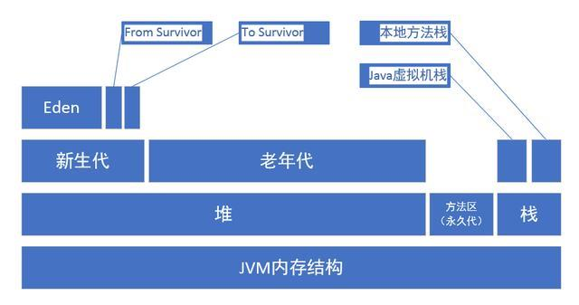

## Java对象的大小

### 在java中，一个空的Object对象占用12B，其中在堆中占用8B，在栈中占用4B
### 计算如下Object对象大小
```
Class NewObject {
    int count;
    boolean flag;
    Object ob;
}
```
#### 其大小为 Object空对象 8B + int大小 4B + boolean大小 1B + 空对象引用大小 4B = 17B；但是因为Java在对象内存分配时都是以8的倍数来分配的，所以此对象实际大小应为：24B


## JVM内存调优

### 主要目的
#### 减少GC的频率
#### 减少Full GC的次数

### Full GC
#### 会对整个堆进行整理，包括Young、Tenured和Perm
#### 导致Full GC的原因
1. 年老代（Tenured）被写满
2. 持久代Pemanet Generation空间不足
3. System.gc()被显示调用

### JVM内存结构


### 堆细分
#### 堆可以划分为两个区域：新生代和老年代
#### 新生代分为den区、s0区、s1区，s0和s1也被称为from和to区域，他们是两块大小相等并且可以互相角色的空间
#### 绝大多数情况下，对象首先分配在eden区，在新生代回收后，如果对象还存活，则进入s0或s1区；之后每经过一次新生代回收，如果对象存活则它的年龄就加1，对象达到一定的年龄后，则进入老年代


### 内存参数设置

1. -Xms设置堆的最小空间大小
2. -Xmx设置堆的最大空间大小
3. -Xmn:设置年轻代大小，一般设为整个堆的1/3到1/4左右
4. -XX:SurvivorRatio 设置新生代中eden区和from/to空间的比例关系n/1
5. -XX:NewRatio 设置新生代和老年代的比例：老年代/新生代
4. -XX:NewSize设置新生代最小空间大小
5. -XX:MaxNewSize设置新生代最大空间大小
8. -Xss设置每个线程的堆栈大小
9. -XX:+UseParallelGC:选择垃圾收集器为并行收集器。此配置仅对年轻代有效。即上述配置下,年轻代使用并发收集,而年老代仍旧使用串行收集
10. -XX:ParallelGCThreads=20:配置并行收集器的线程数,即:同时多少个线程一起进行垃圾回收。此值最好配置与处理器数目相等
11. -XX:+UseSerialGC 串行回收
12. -XX:+PrintGC 每次触发GC的时候打印相关日志
13. -XX:+PrintGCDetails 更详细的GC日志


## 常见内存错误

### OutofMemoryError
#### Java heap space：表示堆内存不够，需要通过-Xms和-Xmx来增大堆内存
#### unable to create newnative thread：栈空间不足以创建额外的线程，可以通过-Xms和-Xmx来减少堆内存从而增大栈内存

### StackOverflowError
#### 线程栈的溢出，两种原因
1. 方法调用层次过多：解决办法是优化程序设计，减少递归调用次数
2. 线程栈太小：解决办法是调整-Xss参数增加线程栈大小 


## 参考文献
### [文献1](https://www.cnblogs.com/andy-zhou/p/5327288.html)


