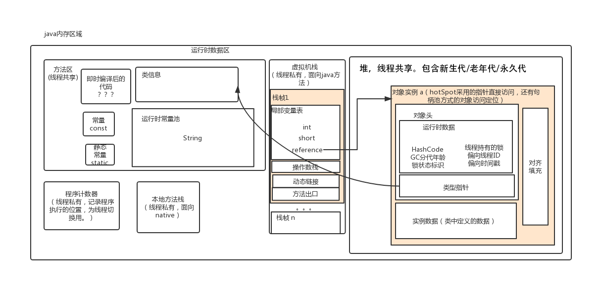
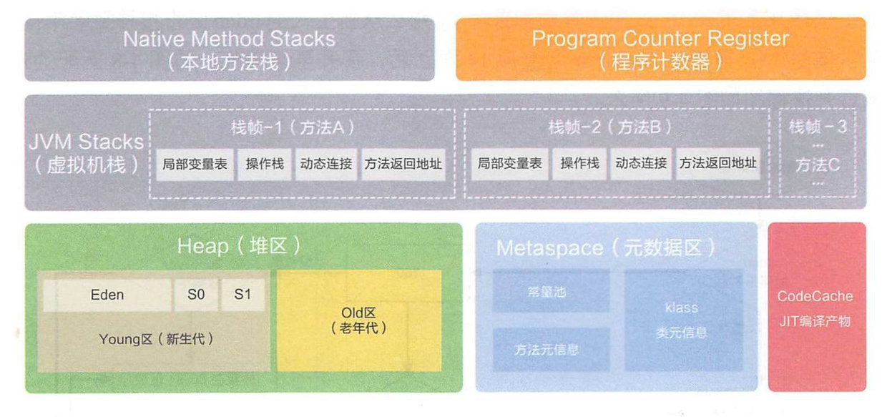
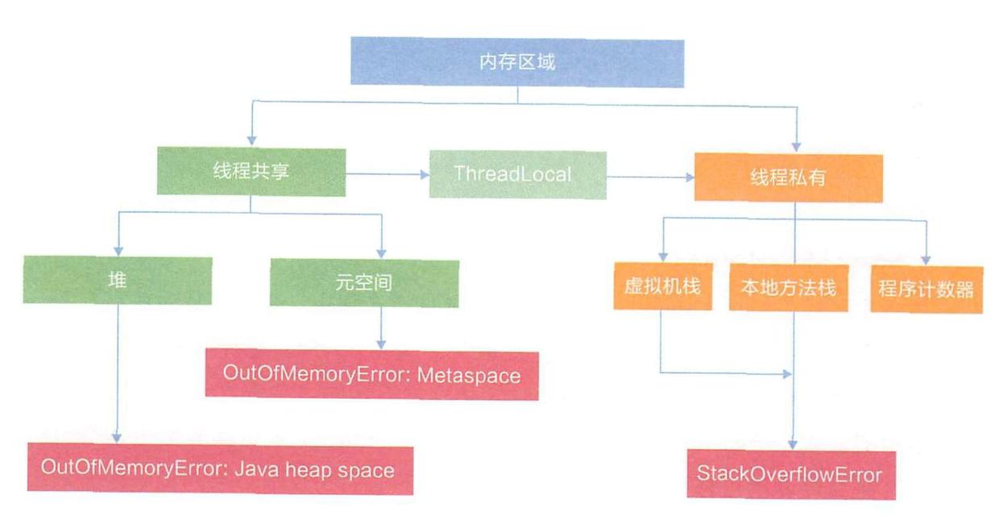
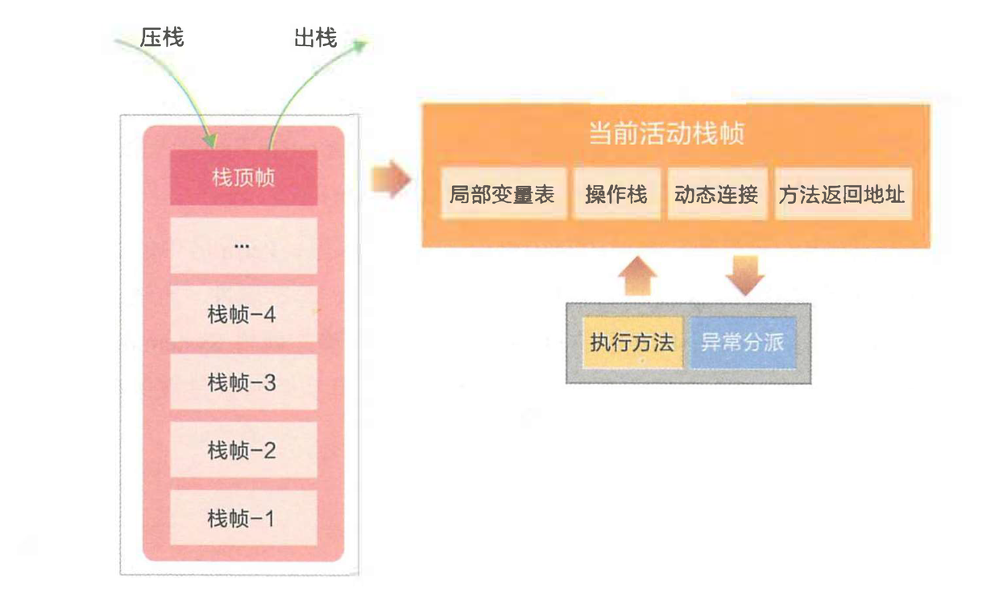

## 整体区域图
### 1.8以前

### 1.8及以后

## 永久代为什么被移除HotSpot JVM了

### 在 HotSpot JVM 中，永久代中用于存放类和方法的元数据以及常量池，比如Class和Method。每当一个类初次被加载的时候，它的元数据都会放到永久代中
### 永久代是有大小限制的，因此如果加载的类太多，很有可能导致永久代内存溢出，即万恶的 java.lang.OutOfMemoryError: PermGen ，为此我们不得不对虚拟机做调优
### 总结两个原因
#### 由于 PermGen 内存经常会溢出，引发恼人的 java.lang.OutOfMemoryError: PermGen，因此 JVM 的开发者希望这一块内存可以更灵活地被管理，不要再经常出现这样的 OOM
#### 移除 PermGen 可以促进 HotSpot JVM 与 JRockit VM 的融合，因为 JRockit 没有永久代

### PermGen 最终被移除，方法区移至 Metaspace，字符串常量移至 Java Heap

## Java内存区域整理

## 程序计数器 Program Counter Register

### 程序计数器（Program Counter Register）是一块较小的内存空间，它可以看作是当前线程所执行的字节码的行号指示器
### 由于 Java 虚拟机的多线程是通过线程轮流切换并分配处理器执行时间的方式来实现的，在任何一个确定的时刻，一个处理器内核都只会执行一条线程中的指令；因此，为了线程切换后能恢复到正确的执行位置，每条线程都需要有一个独立的程序计数器，各条线程之间计数器互不影响，独立存储，我们称这类内存区域为“线程私有”的内存
### 如果线程正在执行的是一个 Java 方法，这个计数器记录的是正在执行的虚拟机字节码指令的地址；如果正在执行的是 Native 方法，这个计数器值则为空（Undefined）。此内存区域是唯一一个在 Java 虚拟机规范中没有规定任何 OutOfMemoryError 情况的区域

## Java虚拟机栈 JVM Stack

### 与程序计数器一样，Java 虚拟机栈（Java Virtual Machine Stacks）也是线程私有的，它的生命周期与线程相同
### 虚拟机栈描述的是 Java 方法执行的内存模型：每个方法在执行的同时都会创建一个栈帧（Stack Frame，是方法运行时的基础数据结构）用于存储局部变量表、操作数栈、动态链接、方法出口等信息。每一个方法从调用直至执行完成的过程，就对应着一个栈帧在虚拟机栈中入栈到出栈的过程
### 在活动线程中，只有栈顶的帧才是有效的，称为当前栈帧。正在执行的方法称为当前方法，栈帧是方法运行的基本结构。在执行引擎运行时，所有指令都只能针对当前栈帧进行操作

#### 局部变量表：存放方法参数和局部变量的区域；如果是非静态方法，则在 index[0] 位置上存储的是方法所属对象的实例引用，一个引用变量占 4 个字节，随后存储的是参数和局部变量
#### 操作栈：初始状态为空的桶式结构栈；在方法执行过程中， 会有各种指令往栈中写入和提取信息。JVM 的执行引擎是基于栈的执行引擎， 其中的栈指的就是操作栈
#### 动态链接：每个栈帧中包含一个在常量池中对当前方法的引用， 目的是支持方法调用过程的动态连接
#### 方法返回地址：方法执行时有两种退出情况
1. 正常退出，即正常执行到任何方法的返回字节码指令，如 RETURN、IRETURN、ARETURN 等
2. 异常退出
#### 无论何种退出情况，都将返回至方法当前被调用的位置。方法退出的过程相当于弹出当前栈帧，退出可能有三种方式：
1. 返回值压入上层调用栈帧
2. 异常信息抛给能够处理的栈帧
3. PC计数器指向方法调用后的下一条指令

## 本地方法栈 Native Method Stack

### 本地方法栈（Native Method Stack）与虚拟机栈所发挥的作用是非常相似的，它们之间的区别不过是虚拟机栈为虚拟机执行 Java 方法（也就是字节码）服务，而本地方法栈则为虚拟机使用到的 Native 方法服务
### 与虚拟机栈一样，本地方法栈区域也会抛出 StackOverflowError 和 OutOfMemoryError 异常
### 本地方法可以通过 JNI(Java Native Interface)来访问虚拟机运行时的数据区，甚至可以调用寄存器，具有和 JVM 相同的能力和权限
### JNI 类本地方法最著名的应该是 System.currentTimeMillis() ，JNI使 Java 深度使用操作系统的特性功能，复用非 Java 代码。 但是在项目过程中， 如果大量使用其他语言来实现 JNI , 就会丧失跨平台特性

## Java堆

### Java 堆是被所有线程共享的一块内存区域，在虚拟机启动时创建。此内存区域的唯一目的就是存放对象实例，几乎所有的对象实例都在这里分配内存
### 堆是垃圾收集器管理的主要区域，因此很多时候也被称做“GC堆”（Garbage Collected Heap）
### 从内存回收的角度来看，由于现在收集器基本都采用分代收集算法，所以 Java 堆中还可以细分为：新生代和老年代；再细致一点的有 Eden 空间、From Survivor 空间、To Survivor 空间等
### 从内存分配的角度来看，线程共享的 Java 堆中可能划分出多个线程私有的分配缓冲区（Thread Local Allocation Buffer,TLAB）

## 方法区 Method Area

### 各个线程共享的内存区域，它用于存储已被虚拟机加载的类信息、常量、静态变量、即时编译器编译后的代码等数据
### 虽然Java 虚拟机规范把方法区描述为堆的一个逻辑部分，但是它却有一个别名叫做 Non-Heap（非堆），目的应该是与 Java 堆区分开来
### Java 虚拟机规范对方法区的限制非常宽松，除了和 Java 堆一样不需要连续的内存和可以选择固定大小或者可扩展外，还可以选择不实现垃圾收集。垃圾收集行为在这个区域是比较少出现的，其内存回收目标主要是针对常量池的回收和对类型的卸载

### JDK8 之前，Hotspot 中方法区的实现是永久代（Perm），JDK8 开始使用元空间（Metaspace），以前永久代所有内容的字符串常量移至堆内存，其他内容移至元空间，元空间直接在本地内存分配
#### 使用metaspace替代permen的原因
1. 字符串存在永久代中，容易出现性能问题和内存溢出
2. 类及方法的信息等比较难确定其大小，因此对于永久代的大小指定比较困难，太小容易出现永久代溢出，太大则容易导致老年代溢出
3. 永久代会为 GC 带来不必要的复杂度，并且回收效率偏低
4. 将 HotSpot 与 JRockit 合二为一

## 运行时常量池 Runtime Constant Pool

### 方法区的一部分。Class 文件中除了有类的版本、字段、方法、接口等描述信息外，还有一项信息是常量池，用于存放编译期生成的各种字面量和符号引用，这部分内容将在类加载后进入方法区的运行时常量池中存放
### 一般来说，除了保存 Class 文件中描述的符号引用外，还会把翻译出来的直接引用也存储在运行时常量池中
### 运行时常量池相对于 Class 文件常量池的另外一个重要特征是具备动态性，Java 语言并不要求常量一定只有编译期才能产生，也就是并非预置入 Class 文件中常量池的内容才能进入方法区运行时常量池，运行期间也可能将新的常量放入池中，这种特性被开发人员利用得比较多的便是 String 类的 intern() 方法

## 直接内存 Direct Memory
### 在 JDK 1.4 中新加入了 NIO，引入了一种基于通道（Channel）与缓冲区（Buffer）的 I/O 方式，它可以使用 Native 函数库直接分配堆外内存，然后通过一个存储在 Java 堆中的 DirectByteBuffer 对象作为这块内存的引用进行操作。这样能在一些场景中显著提高性能，因为避免了在 Java 堆和 Native 堆中来回复制数据

## i++和++i的区别
### i++：从局部变量表取出 i 并压入操作栈(load memory)，然后对局部变量表中的 i 自增 1(add&store memory)，将操作栈栈顶值取出使用，如此线程从操作栈读到的是自增之前的值
### ++i：先对局部变量表的 i 自增 1(load memory&add&store memory)，然后取出并压入操作栈(load memory)，再将操作栈栈顶值取出使用，线程从操作栈读到的是自增之后的值

## StackOverflowError和OutoutMemoryError
### StackOverflowError：递归过深，递归没有出口
### OutOfMemoryError：JVM空间溢出，创建对象速度高于GC回收速度

## 参考文献
### [文献1](https://www.cnblogs.com/czwbig/p/11127124.html)
### [文献2](https://www.sczyh30.com/posts/Java/jvm-metaspace/)