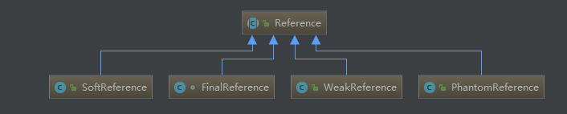

### 除了FinalReference强引用类是包内可见外，其余三个类都是public class


## 强引用
### 使用最普遍的引用，如```A a = new A()``
### 强引用的对象，GC是不会对它进行回收的，即使内存不足，JVM也宁愿抛出异常使程序终止也不会回收强引用对象


## 弱引用
### 弱引用与软引用的区别在于：只具有弱引用的对象拥有更短暂的生命周期。在垃圾回收器线程扫描它所管辖的内存区域的过程中，一旦发现了只具有弱引用的对象，不管当前内存空间足够与否，都会回收它的内存
### 弱引用是在第二次GC时回收
### 弱引用可以和一个引用队列（ReferenceQueue）联合使用，如果弱引用所引用的对象被垃圾回收，Java虚拟机就会把这个弱引用加入到与之关联的引用队列中
### 实例
```
public class Solution {

    public static void main(String[] args) {

        Object object = new Object();
        WeakReference reference = new WeakReference(object);
        object = null;
        // 手动进行gc后，输出null
//        System.gc();
        System.out.println(reference.get());
        // 返回对象是否被垃圾回收器标记
        System.out.println(reference.isEnqueued());
    }

}
```
### 弱引用主要用于监控对象是否已经被垃圾回收器标记为即将回收的垃圾


## 软引用
### 对于软引用的对象，如果内存空间足够，则GC不会回收它；如果内存空间不足，则GC会对它们进行回收
### 软引用可以和一个引用队列（ReferenceQueue）联合使用，如果软引用所引用的对象被垃圾回收器回收，Java虚拟机就会把这个软引用加入到与之关联的引用队列中
### 实例
```
import java.lang.ref.SoftReference;

public class Solution {

    public static void main(String[] args) {

        Object object = new Object();
        SoftReference reference = new SoftReference(object);
        object = null;
        // 内存足够的情况下会获取object对象，内存不足的情况下会获取null
        System.out.println(reference.get());
    }

}
```
### SoftReference弱引用常用于实现某些数据的缓存功能，在内存足够的情况下直接通过软引用取值，无需从繁忙的真实来源查询数据，提升速度；当内存不足时，自动删除这部分缓存数据，从真正的来源查询这些数据


## 虚引用
### 虚引用并不会决定对象的生命周期。如果一个对象仅持有虚引用，那么它就和没有任何引用一样，在任何时候都可能被垃圾回收器回收
### 虚引用主要用来跟踪对象被垃圾回收器回收的活动
### 虚引用必须和引用队列 （ReferenceQueue）联合使用。当垃圾回收器准备回收一个对象时，如果发现它还有虚引用，就会在回收对象的内存之前，把这个虚引用加入到与之 关联的引用队列中
### 基于上面的特性，虚引用可以用来跟踪对象被垃圾回收期回收的活动，程序可以通过判断引用队列中是否已经加入了虚引用来了解被引用的对象是否将要被垃圾回收
### 实例
```
public class Solution {

    public static void main(String[] args) {

        Object object = new Object();
        ReferenceQueue queue = new ReferenceQueue();
        // 虚引用必须和ReferenceQueue进行关联
        PhantomReference reference = new PhantomReference(object, queue);
        object = null;
        // 输出null
        System.out.println(reference.get());
        // 检测对象是否已经从内存中删除
        System.out.println(reference.isEnqueued());
    }

}
```


