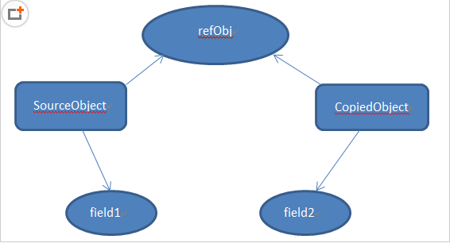
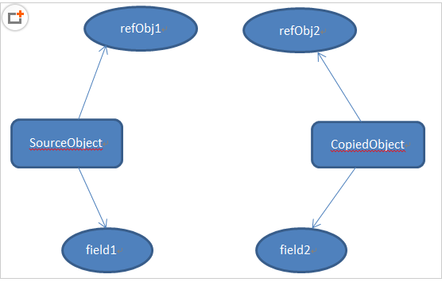

## 前戏

### Java数据划分两类：基本数据类型和引用数据类型，分别对应着值传递和引用传递两种不同的数据传递方式


## 浅拷贝

### 数据传递

#### 对于数据类型是基本数据类型的成员变量，浅拷贝会直接进行值传递，也就是将该属性值复制一份给新的对象；因为是两份不同的数据，所以对其中一个对象的该成员变量值进行修改，不会影响另一个对象拷贝得到的数据

#### 对于数据类型是引用数据类型的成员变量，比如说成员变量是某个数组、某个类的对象等，那么浅拷贝会进行引用传递，也就是只是将该成员变量的引用值（内存地址）复制一份给新的对象。因为实际上两个对象的该成员变量都指向同一个实例。在这种情况下，在一个对象中修改该成员变量会影响到另一个对象的该成员变量值



### 实现方式

#### 通过拷贝构造方法实现

```
class Person{

    //两个属性值：分别代表值传递和引用传递
    private Age age;
    private String name;
    
    //拷贝构造方法
    public Person(Person p) {
        this.name=p.name;
        this.age=p.age;
    }
}
```

#### 通过重写Object类的clone()方法实现，注意两点：
1. Object类虽然有这个方法，但是这个方法是受保护的（被protected修饰），所以我们无法直接使用，如果想要使用clone方法实现浅拷贝，就必须要重写该方法
2. 使用clone方法的类必须实现Cloneable接口，否则会抛出异常CloneNotSupportedException

```
class Student implements Cloneable{

    private String name;
    private int length;
    
    public String getName() {
        return name;
    }

    public void setName(String name) {
        this.name = name;
    }
    
    public int getLength() {
        return this.length;
    }
    
    public void setLength(int length) {
        this.length=length;
    }
    //设置输出的字符串形式
    public String toString() {
        return "姓名是： "+this.getName()+"，长度是： "+this.getLength();
    }
    //重写Object类的clone方法
    public Object clone() {
        Object obj=null;
        //调用Object类的clone方法，返回一个Object实例
        try {
            obj= super.clone();
        } catch (CloneNotSupportedException e) {
            e.printStackTrace();
        }
        return obj;
    }
}
```


## 深拷贝

### 数据传递

#### 深拷贝对引用数据类型的成员变量的对象图中所有的对象都开辟了内存空间；而浅拷贝只是传递地址指向，新的对象并没有对引用数据类型创建内存空间

#### 简单来说就是深拷贝获得的对象的任何操作都不会影响到原对象的属性值


### 实现方式

#### 通过重写Object类的clone方法实现：
1. 将对象序列化为字节序列后，默认会将该对象的整个对象图进行序列化，再通过反序列即可完美地实现深拷贝
2. 实现Serializable接口即可实现对象的序列化和反序列化
3. 如果某个属性被transient关键字修饰，那么该属性就无法被拷贝了

```
/*
 * 创建年龄类
 */
class Age implements Cloneable{
    //年龄类的成员变量（属性）
    private int age;
    //构造方法
    public Age(int age) {
        this.age=age;
    }
    
    public int getAge() {
        return age;
    }
    
    public void setAge(int age) {
        this.age = age;
    }
    
    public String toString() {
        return this.age+"";
    }
    
    //重写Object的clone方法
    public Object clone() {
        Object obj=null;
        try {
            obj=super.clone();
        } catch (CloneNotSupportedException e) {
            e.printStackTrace();
        }
        return obj;
    }
}
/*
 * 创建学生类
 */
class Student implements Cloneable{

    //学生类的成员变量（属性）,其中一个属性为类的对象
    private String name;
    private Age aage;
    private int length;
    
    public String getName() {
        return name;
    }

    public void setName(String name) {
        this.name = name;
    }
    
    public Age getaAge() {
        return this.aage;
    }
    
    public void setaAge(Age age) {
        this.aage=age;
    }
    
    public int getLength() {
        return this.length;
    }
    
    public void setLength(int length) {
        this.length=length;
    }
    
    //重写Object类的clone方法
    @Override
    public Object clone() {
        Object obj=null;
        //调用Object类的clone方法――浅拷贝
        try {
            obj= super.clone();
        } catch (CloneNotSupportedException e) {
            e.printStackTrace();
        }
        //调用Age类的clone方法进行深拷贝
        //先将obj转化为学生类实例
        Student stu=(Student)obj;
        //学生类实例的Age对象属性，调用其clone方法进行拷贝
        stu.aage=(Age)stu.getaAge().clone();
        return obj;
    }
}
```

#### 通过序列化实现

```
/*
 * 创建年龄类
 */
class Age implements Serializable{
    //年龄类的成员变量（属性）
    private int age;
    //构造方法
    public Age(int age) {
        this.age=age;
    }
    
    public int getAge() {
        return age;
    }
    
    public void setAge(int age) {
        this.age = age;
    }
    
    public String toString() {
        return this.age+"";
    }
}
/*
 * 创建学生类
 */
class Student implements Serializable{

    //学生类的成员变量（属性）,其中一个属性为类的对象
    private String name;
    private Age aage;
    private int length;
    
    public String getName() {
        return name;
    }

    public void setName(String name) {
        this.name = name;
    }
    
    public Age getaAge() {
        return this.aage;
    }
    
    public void setaAge(Age age) {
        this.aage=age;
    }
    
    public int getLength() {
        return this.length;
    }
    
    public void setLength(int length) {
        this.length=length;
    }
    //设置输出的字符串形式
    public String toString() {
        return "姓名是： "+this.getName()+"， 年龄为： "+this.getaAge().toString()+", 长度是： "+this.getLength();
    }
}

public class Test {
    
    public static void main(String[] args) {
        
        Age a=new Age(20);
        Student stu1=new Student("摇头耶稣",a,175);
        //通过序列化方法实现深拷贝
        ByteArrayOutputStream bos=new ByteArrayOutputStream();
        ObjectOutputStream oos=new ObjectOutputStream(bos);
        oos.writeObject(stu1);
        oos.flush();
        ObjectInputStream ois=new ObjectInputStream(new ByteArrayInputStream(bos.toByteArray()));
        Student stu2=(Student)ois.readObject();
        System.out.println(stu1.toString());
        System.out.println(stu2.toString());
        System.out.println();
    }
}
```


## 参考文献

### [文献1](https://www.cnblogs.com/shakinghead/p/7651502.html#4762341)