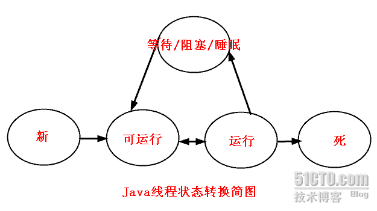

## 进程与线程

### 进程
#### 进程是指一个内存中运行的应用程序，每个进程都有自己独立的一块内存空间，即进程空间或（虚空间）。进程不依赖于线程而独立存在，一个进程中可以启动多个线程
#### 进程是系统进行资源分配和调度的一个独立单位
### 线程
#### 线程是指进程中的一个执行流程，一个进程中可以运行多个线程
#### 线程是进程的一个实体，是CPU调度和分派的基本单位，它是比进程更小的能独立运行的基本单位
#### 线程有自己的堆栈和局部变量，但线程之间没有单独的地址空间，一个线程包含以下内容
1.  一个指向当前被执行指令的指令指针
2. 一个栈
3. 一个寄存器值的集合，定义了一部分描述正在执行线程的处理器状态的
4. 一个私有的数据区

## Java线程

### 创建方式
#### 扩展java.lang.Thread类
```
public class Thread implements Runnable {
    ...
}
```
#### 实现java.lang.Runnable接口
```
@FunctionalInterface
public interface Runnable {
    public abstract void run();
}
```

### 实例化方式
#### 如果是通过扩展Thread类，则直接new即可
#### 如果是通过实现Runnable接口，则需要借助于Thread的构造方法
```
public Thread(Runnable target) {
    init(null, target, "Thread-" + nextThreadNum(), 0);
}
```

### 线程启动：Thread.class.start()
####  在调用start()方法之前：线程处于新状态中，新状态指有一个Thread对象，但还没有一个真正的线程
#### 在调用start()方法之后：发生了一系列复杂的事情
1. 启动新的执行线程（具有新的调用栈）
2. 该线程从新状态转移到可运行状态
3. 当该线程获得机会执行时，其目标run()方法将运行

### 线程几种状态

#### 新状态：线程对象已经创建，还没有在其上调用start()方法
#### 可运行状态：当线程有资格运行，但调度程序还没有把它选定为运行线程时线程所处的状态
1. 当start()方法调用时，线程首先进入可运行状态
2. 在线程运行之后或者从阻塞、等待或睡眠状态回来后，也返回到可运行状态
#### 运行状态：线程调度程序从可运行池中选择一个线程作为当前线程时线程所处的状态。这也是线程进入运行状态的唯一一种方式
#### 等待/阻塞/睡眠状态：这是线程有资格运行时它所处的状态。实际上这个三状态组合为一种，其共同点是：线程仍旧是活的，但是当前没有条件运行。换句话说，它是可运行的，但是如果某件事件出现，他可能返回到可运行状态
#### 死亡态：当线程的run()方法完成时就认为它死去


### 不考虑IO阻塞的情况下阻止线程执行的方式
#### 睡眠
1. Thread.sleep(longmillis)和Thread.sleep(long millis, int nanos)
2. 当线程睡眠时，它入睡在某个地方，在苏醒之前不会返回到可运行状态。当睡眠时间到期，则返回到可运行状态
3. 需要注意的是：通过sleep方法进入休眠的线程不会释放持有的锁
#### 等待
1. Thread.yield()：暂停当前正在执行的线程对象，并执行其他线程；实际中无法保证yield()达到让步目的，因为让步的线程还有可能被线程调度程序再次选中
2. Thread.class.join()：保证当前线程停止执行，直到该线程所加入的线程完成为止。然而，如果它加入的线程没有存活，则当前线程不需要停止
```
public class ThreadTest {

    public static void main(String[] args) {

        Thread thread = new Thread() {
            @Override
            public void run() {
                for (int i = 0; i < 10; i++) {
                    System.out.println("第" + i + "次执行");
                }
            }
        };

        thread.start();

        for (int i = 0; i < 10; i++) {
            System.out.println("主线程第" + i + "次执行");
            if(i > 2) {
                try {
                    // 当i>2时，则停止main线程执行，知道thread线程执行完之后再执行
                    // 可以看做是线程合并
                    thread.join();
                } catch (Exception e) {
                    e.printStackTrace();
                }
            }
        }
    }

}
```
#### 因为需要一个对象的锁定而被阻塞
1. lock机制：如synchronized、object.wait() 和 object.notify()


### 线程的同步
#### synchronized同步方法
```
public synchronized int getX() {  
    return x++;  
} 

public static synchronized int getX() {
    return x++;
}
```
#### synchronized同步代码块
```
public int fix(int y) {  
   synchronized (this) {  
       x = x - y;  
   }  
   return x;  
}

public static int fix(int y) {
    synchronized(Xxx.class) {
        x = x - y;;
    }
    return x;
} 
```


### 线程交互
#### Object类的实例方法
```
void notify()：唤醒在此对象监视器上等待的单个线程
void notifyAll()：唤醒在此对象监视器上等待的所有线程
void wait()：导致当前线程的等待，直到其他线程调用此对象的notify()或notifyAll()
```
#### 注意
1. wait方法会立即释放持有的锁并且进入睡眠状态
2. notify和notifyAll不会立即释放持有的锁，当前线程继续执行


### 有返回值的线程
#### 1.5后新增，实现Callable接口的线程可返回值
```
public class ThreadTest {

    public static void main(String[] args) throws ExecutionException, InterruptedException {

        Callable callable = new Callable() {
            @Override
            public Object call() throws Exception {
                return "welcome";
            }
        };

        ExecutorService executorService = Executors.newSingleThreadExecutor();
        Future future = executorService.submit(callable);
        System.out.println(future.get());
        executorService.shutdown();
    }

}
```


## Java线程新特征

### 锁
#### java.util.concurrent.locks.Condition
#### java.util.concurrent.locks.Lock
#### java.util.concurrent.locks.ReadWriteLock

### 信号量
#### Semaphore

### 阻塞队列
#### java.util.concurrent.BlockingQueue

### 阻塞栈
#### java.util.concurrent.BlockingDeque

### 原子量
#### java.util.concurrent.atomic.AtomicLong
#### java.util.concurrent.atomic.AtomicInteger

### 障碍器
#### java.util.concurrent.CyclicBarrier


## 参考文献
### [文献1](https://blog.csdn.net/kwame211/article/details/78963044)


