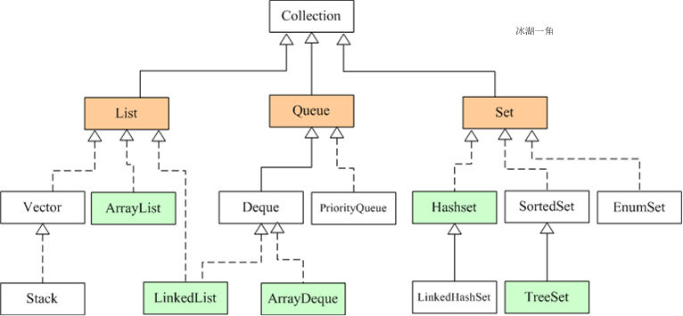
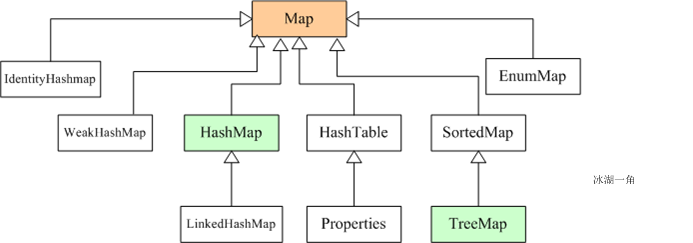

## Set集合

### 性质
#### 不允许存储相同的元素，会自动去重，判断重复是通过对象的equals和hashcode方法

### HashSet
#### 通过hash算法来存储元素，具有很好的存取和查找性能
#### 不能保证元素有序
#### 线程非安全

### SortedSet
#### 保证元素有序
#### TreeSet：通过调用集合元素的compareTo(Object obj)来比较元素之间的大小，所以使用TreeSet存储的元素对应的类型必须实现了Comaprable接口

## EnumSet
#### 定义
```
public abstract class EnumSet<E extends Enum<E>> 
    extends AbstractSet<E>
    implements Cloneable, java.io.Serializable
```
#### 主要用于存储枚举类元素，其中的元素也是有序的，顺序是按照使用的枚举类定义的元素顺序


## List集合

### 性质
#### 元素可重复
#### 各元素的顺序按照其添加的顺序进行排列

### ArrayList
#### 内部通过数组实现
#### 允许插入null值

### LinkedList
#### 内部通过链表的形式实现

### Vector
#### 与ArrayList相似，区别在于Vector是线程安全的

### Stack
#### 继承自Vector，是一个先进后出的栈
#### 提供pop、peek和push方法


### Iterator接口
#### 集合的迭代器，主要提供三个方法
1. boolean hasNext()：判断集合里是否存在下一个元素。如果有，hasNext()方法返回 true
2. Object next()：返回集合里下一个元素
3. void remove()：删除集合里上一次next方法返回的元素

### ListIterator接口
#### 专门用于List的迭代器，继承自Iterator接口，额外提供了三个方法
2. boolean hasPrevious()：判断集合里是否存在上一个元素。如果有，该方法返回 true
2. Object previous()：返回集合里上一个元素
3. void add(Object o)：在指定位置插入一个元素


## Map集合

### 性质
#### 采用key->value 键值对的形式存储数据

### HashMap
#### 线程非安全
#### 可以使用null作为key和value

### HashTable
#### 线程安全
#### 不可以使用null作为key和value

### LinkedHashMap
#### 继承自HashMap
#### 使用双向链表来维护key-value对的次序(与插入顺序一致)
#### 插入性能比HashMap低，迭代访问全部元素的性能比HashMap高

### Properties
#### 继承自HashTable，也是线程安全的类
#### 类似于一个key和value都是String类型的Map
#### 主要用于操作配置文件

### TreeMap
#### SortedMap的实现类
#### Key对应的类型必须实现Comparable接口，TreeMap通过调用Key对象的compareTo方法来确定key之间的顺序


## 参考文献
### [文献1](https://www.cnblogs.com/bingyimeiling/p/10255037.html)


