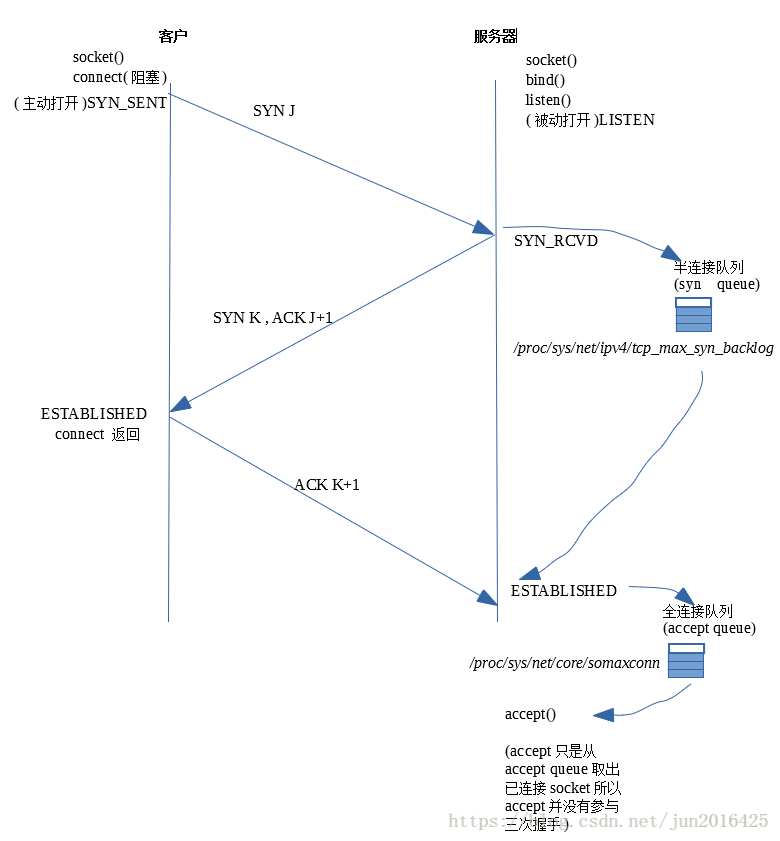

## 简述三次握手
###
### 第一次握手
#### 客户在socket() connect()后主动(active open)连接上服务器, 发送SYN ，这时客户端的状态是SYN_SENT
服务器在进行socket(),bind(),listen()后等待客户的连接
#### 收到客户端的连接通知后，如果半连接队列syn_queue未满，则服务器将该连接的状态变为SYN_RCVD, 并把连接信息放到半连接队列(syn queue)里面；
#### 如果半连接队列syn_queue已满，则服务器会将该连接丢弃;

### 第二次握手
#### 服务器返回SYN+ACK给到客户端，客户端收到SYN+ACK后，状态从SYN_SENT变为ESTABLISHED，也即是connect()函数的返回。

### 第三次握手
#### 全连接队列accept_queue最大值默认128
#### 服务器收到客户端发来的ACK，如果accept_queue未满，则服务器将该连接的状态从SYNC_RCVD变为ESTABLISHED，然后将连接从sync_queue中移除，并加入到accept_queue中；
#### 如果accept_queue已满，则根据tcp_abort_on_overflow的值来执行相应的操作：
#### tcp_abort_on_overflow=0：服务器建立该连接对应的定时器，规则是重新发送第二次连接的时间间隔成倍增加，名为二进制指数退让：1、2、4、8、16...
#### tcp_abort_on_overflow=1：重置连接
#### 

## 为什么不是两次
### 主要防止已经失效的连接请求报文突然又传送到了服务器，从而产生错误。
### 如果使用的是两次握手建立连接，假设有这样一种场景，客户端发送了第一个请求连接并且没有丢失，只是因为在网络结点中滞留的时间太长了，由于TCP的客户端迟迟没有收到确认报文，以为服务器没有收到，此时重新向服务器发送这条报文，此后客户端和服务器经过两次握手完成连接，传输数据，然后关闭连接。此时此前滞留的那一次请求连接，网络通畅了到达了服务器，这个报文本该是失效的，但是，两次握手的机制将会让客户端和服务器再次建立连接，这将导致不必要的错误和资源的浪费。
### 如果采用的是三次握手，就算是那一次失效的报文传送过来了，服务端接受到了那条失效报文并且回复了确认报文，但是客户端不会再次发出确认。由于服务器收不到确认，就知道客户端并没有请求连接。

## 参考文献
### [TCP三次握手详解-深入浅出(有图实例演示)](https://blog.csdn.net/jun2016425/article/details/81506353)
### [TCP连接为什么是三次](https://www.zhihu.com/question/24853633)
### [为什么 TCP 建立连接是三次握手，关闭连接确是四次挥手呢？](https://blog.csdn.net/youanyyou/article/details/89391711)