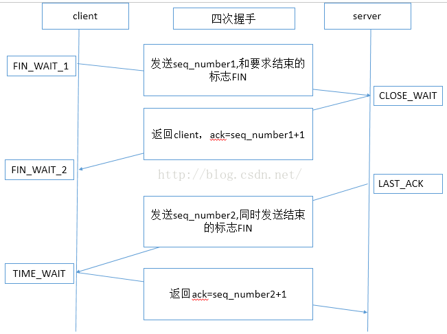

## 简述四次挥手
### 
### 注意：中断连接端可以是Client端，也可以是Server端
### 几种状态：
#### FIN_WAIT_1：等待对方的FIN报文，具体表示为当SOCKET在ESTABLISHED状态时，它想主动关闭连接，向对方发送了FIN报文
#### FIN_WAIT_2：也是等待对方的FIN报文，具体表示为对方发送了ACK报文接收后，进入到FIN_WAIT_2状态
#### CLOSE_WAIT：被动关闭一方接收到对方发来的FIN报文并回应ACK报文之后就进入到CLOSE_WAIT状态，这种状态下需要做的就是等待自己处理完数据关闭连接
#### LAST_ACK：被动关闭一方在发送FIN报文之后进入到LAST_ACK状态，等待主动关闭一方的ACK应答
#### TIME_WAIT：主动方接收到另一方发送的FIN报文之后，发送ACK应答报文并进入到TIME_WAIT状态，等待2MSL后便会进入到CLOSED状态
#### CLOSED：表示连接中断

## 为什么不是三次
### TCP协议是一种面向连接的、可靠的、基于字节流的运输层通信协议。TCP是全双工模式，这就意味着，当主机1发出FIN报文段时，只是表示主机1已经没有数据要发送了，主机1告诉主机2，它的数据已经全部发送完毕了；但是，这个时候主机1还是可以接受来自主机2的数据；当主机2返回ACK报文段时，表示它已经知道主机1没有数据发送了，但是主机2还是可以发送数据到主机1的；当主机2也发送了FIN报文段时，这个时候就表示主机2也没有数据要发送了，就会告诉主机1，我也没有数据要发送了，之后彼此就会愉快的中断这次TCP连接

## 参考文献
### [TCP四次挥手](https://blog.csdn.net/daguairen/article/details/52673194)